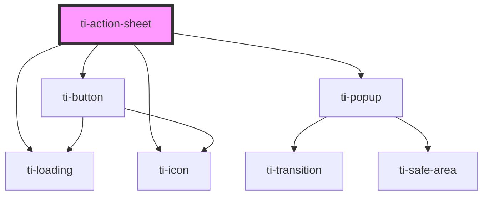

# ti-action-sheet

<!-- Auto Generated Below -->

## Properties

| Property     | Attribute     | Description | Type           | Default     |
| ------------ | ------------- | ----------- | -------------- | ----------- |
| `actions`    | --            |             | `ActionItem[]` | `[]`        |
| `cancelText` | `cancel-text` |             | `string`       | `undefined` |
| `hoverClass` | `hover-class` |             | `string`       | `undefined` |
| `title`      | `title`       |             | `string`       | `undefined` |
| `visible`    | `visible`     |             | `boolean`      | `false`     |

## Events

| Event    | Description | Type                      |
| -------- | ----------- | ------------------------- |
| `cancel` |             | `CustomEvent<never>`      |
| `close`  |             | `CustomEvent<never>`      |
| `select` |             | `CustomEvent<ActionItem>` |

## Dependencies

### Depends on

- [ti-loading](../loading)
- [ti-icon](../icon)
- [ti-popup](../popup)
- [ti-button](../button)

### Graph

----------------------------------------------

*Built with [StencilJS](https://stenciljs.com/)*
