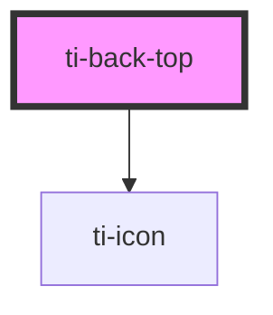

# ti-back-top

<!-- Auto Generated Below -->

## Properties

| Property           | Attribute           | Description                       | Type                                      | Default     |
| ------------------ | ------------------- | --------------------------------- | ----------------------------------------- | ----------- |
| `duration`         | `duration`          | 滚动到顶部时间（ms）                       | `number`                                  | `300`       |
| `extClass`         | `ext-class`         | 额外的类名，添加到根节点的元素上                  | `any`                                     | `undefined` |
| `extStyle`         | --                  | 额外的样式                             | `{}`                                      | `{}`        |
| `target`           | --                  | 设置需要监听其滚动事件的元素，值为一个返回对应 DOM 元素的函数 | `() => HTMLElement \| Document \| Window` | `undefined` |
| `text`             | `text`              | 展示文字                              | `string`                                  | `undefined` |
| `visibilityHeight` | `visibility-height` | 滚动距顶部指定距离后展示                      | `number`                                  | `400`       |

## Events

| Event   | Description   | Type                 |
| ------- | ------------- | -------------------- |
| `click` | 绑定点击事件并触发返回顶部 | `CustomEvent<never>` |

## Dependencies

### Depends on

- [ti-icon](../icon)

### Graph

----------------------------------------------

*Built with [StencilJS](https://stenciljs.com/)*
