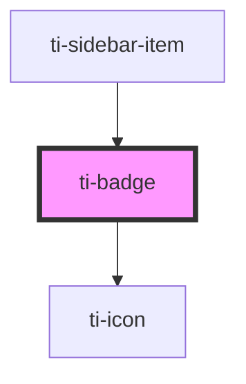

# ti-badge

<!-- Auto Generated Below -->

## Properties

| Property   | Attribute   | Description      | Type               | Default             |
| ---------- | ----------- | ---------------- | ------------------ | ------------------- |
| `atText`   | `at-text`   |                  | `string`           | `undefined`         |
| `content`  | `content`   |                  | `number \| string` | `undefined`         |
| `dot`      | `dot`       |                  | `boolean`          | `false`             |
| `extClass` | `ext-class` | 额外的类名，添加到根节点的元素上 | `string`           | `''`                |
| `extStyle` | --          | 额外的样式            | `{}`               | `{}`                |
| `icon`     | `icon`      |                  | `string`           | `undefined`         |
| `offset`   | --          |                  | `any[]`            | `[]`                |
| `spread`   | `spread`    |                  | `string`           | `EBadgeSpread.BOTH` |
| `static`   | `static`    |                  | `boolean`          | `false`             |

## Dependencies

### Used by

 - [ti-sidebar-item](../sidebar-item)

### Depends on

- [ti-icon](../icon)

### Graph

----------------------------------------------

*Built with [StencilJS](https://stenciljs.com/)*
