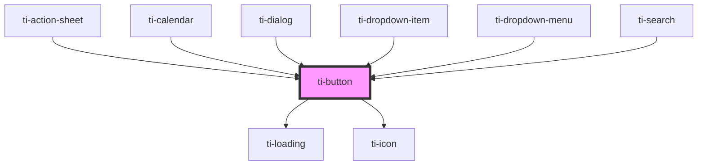

# ti-button

<!-- Auto Generated Below -->

## Properties

| Property           | Attribute            | Description      | Type                      | Default                    |
| ------------------ | -------------------- | ---------------- | ------------------------- | -------------------------- |
| `block`            | `block`              |                  | `boolean`                 | `undefined`                |
| `buttonInnerClass` | `button-inner-class` |                  | `string`                  | `''`                       |
| `color`            | `color`              |                  | `string`                  | `undefined`                |
| `disabled`         | `disabled`           |                  | `boolean`                 | `undefined`                |
| `extClass`         | `ext-class`          | 额外的类名，添加到根节点的元素上 | `string`                  | `''`                       |
| `extStyle`         | `ext-style`          | 额外的样式            | `string`                  | `''`                       |
| `hairline`         | `hairline`           |                  | `boolean`                 | `true`                     |
| `loading`          | `loading`            |                  | `boolean`                 | `undefined`                |
| `loadingClass`     | `loading-class`      |                  | `string`                  | `''`                       |
| `loadingSize`      | `loading-size`       |                  | `number`                  | `30`                       |
| `loadingText`      | `loading-text`       |                  | `string`                  | `undefined`                |
| `loadingType`      | `loading-type`       |                  | `"circular" \| "spinner"` | `undefined`                |
| `prefixIcon`       | `prefix-icon`        |                  | `string`                  | `undefined`                |
| `prefixIconClass`  | `prefix-icon-class`  |                  | `string`                  | `''`                       |
| `shape`            | `shape`              |                  | `string`                  | `EButtonShape.ROUND`       |
| `size`             | `size`               |                  | `string`                  | `EButtonSize.BIG`          |
| `suffixIcon`       | `suffix-icon`        |                  | `string`                  | `undefined`                |
| `suffixIconClass`  | `suffix-icon-class`  |                  | `string`                  | `''`                       |
| `type`             | `type`               |                  | `string`                  | `EButtonType.PRIMARY`      |
| `variant`          | `variant`            |                  | `string`                  | `EButtonVariant.CONTAINED` |

## Events

| Event   | Description | Type                 |
| ------- | ----------- | -------------------- |
| `click` |             | `CustomEvent<never>` |

## Dependencies

### Used by

 - [ti-action-sheet](../action-sheet)
 - [ti-calendar](../calendar)
 - [ti-dialog](../dialog)
 - [ti-dropdown-item](../dropdown-item)
 - [ti-dropdown-menu](../dropdown-menu)
 - [ti-search](../search)

### Depends on

- [ti-loading](../loading)
- [ti-icon](../icon)

### Graph

----------------------------------------------

*Built with [StencilJS](https://stenciljs.com/)*
