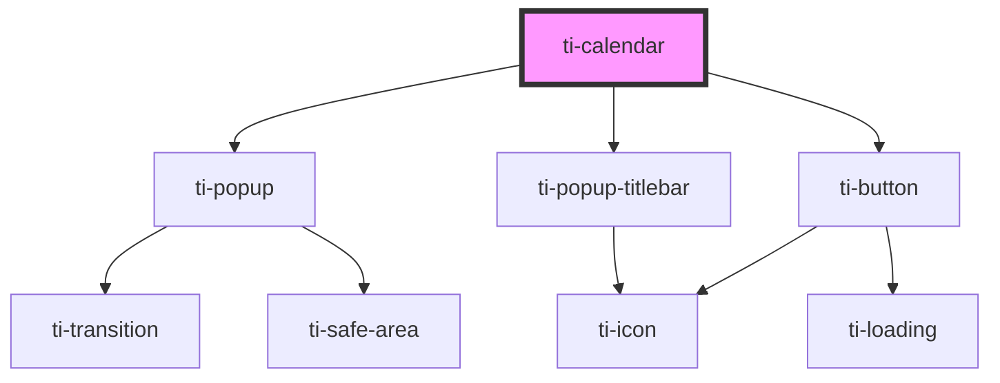

# ti-calendar

<!-- Auto Generated Below -->

## Properties

| Property               | Attribute                 | Description | Type                                               | Default                    |
| ---------------------- | ------------------------- | ----------- | -------------------------------------------------- | -------------------------- |
| `allowSameDay`         | `allow-same-day`          |             | `boolean`                                          | `false`                    |
| `closeOnMask`          | `close-on-mask`           |             | `boolean`                                          | `defaultProps.closeOnMask` |
| `color`                | `color`                   |             | `string`                                           | `defaultProps.color`       |
| `confirmText`          | `confirm-text`            |             | `string`                                           | `defaultProps.confirmText` |
| `defaultValue`         | `default-value`           |             | `CalDateTimeType[] \| Date \| number \| string`    | `null`                     |
| `destroyOnClose`       | `destroy-on-close`        |             | `boolean`                                          | `false`                    |
| `extClass`             | `ext-class`               |             | `string`                                           | `''`                       |
| `extPopupClass`        | `ext-popup-class`         |             | `string`                                           | `''`                       |
| `extPopupContentClass` | `ext-popup-content-class` |             | `string`                                           | `''`                       |
| `extPopupMaskClass`    | `ext-popup-mask-class`    |             | `string`                                           | `''`                       |
| `extStyle`             | `ext-style`               |             | `string \| { [key: string]: string; }`             | `''`                       |
| `formatter`            | --                        |             | `(date: CalRenderDateProps) => CalRenderDateProps` | `undefined`                |
| `maxDate`              | `max-date`                |             | `number`                                           | `defaultProps.maxDate`     |
| `maxRange`             | `max-range`               |             | `number`                                           | `defaultProps.maxRange`    |
| `maxSize`              | `max-size`                |             | `number`                                           | `defaultProps.maxSize`     |
| `minDate`              | `min-date`                |             | `number`                                           | `defaultProps.minDate`     |
| `mode`                 | `mode`                    |             | `"multiple" \| "range" \| "single"`                | `defaultProps.mode`        |
| `position`             | `position`                |             | `string`                                           | `defaultProps.position`    |
| `round`                | `round`                   |             | `boolean`                                          | `false`                    |
| `start`                | `start`                   |             | `string`                                           | `defaultProps.start`       |
| `title`                | `title`                   |             | `string`                                           | `defaultProps.title`       |
| `value`                | `value`                   |             | `CalDateTimeType[] \| Date \| number \| string`    | `null`                     |
| `visible`              | `visible`                 |             | `boolean`                                          | `false`                    |

## Events

| Event     | Description | Type                                                                                            |
| --------- | ----------- | ----------------------------------------------------------------------------------------------- |
| `close`   |             | `CustomEvent<any>`                                                                              |
| `confirm` |             | `CustomEvent<any>`                                                                              |
| `error`   |             | `CustomEvent<{ error: CalErrorProps; date: CalDateProps; currentDate: CalRenderDateProps[]; }>` |
| `select`  |             | `CustomEvent<{ date: CalDateProps; currentDate: CalRenderDateProps[]; }>`                       |

## Dependencies

### Depends on

- [ti-popup](../popup)
- [ti-popup-titlebar](../popup-titlebar)
- [ti-button](../button)

### Graph

----------------------------------------------

*Built with [StencilJS](https://stenciljs.com/)*
