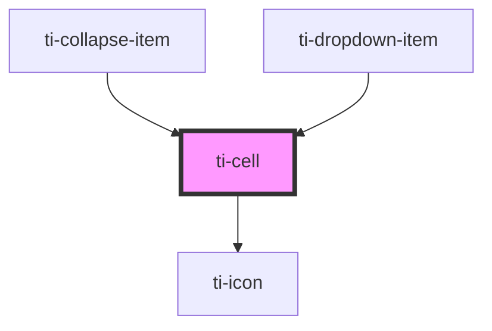

# ti-cell

<!-- Auto Generated Below -->

## Properties

| Property        | Attribute         | Description      | Type                                                                | Default     |
| --------------- | ----------------- | ---------------- | ------------------------------------------------------------------- | ----------- |
| `alignItems`    | `align-items`     | 内容块的横向排列方式       | `"baseline" \| "center" \| "flex-end" \| "flex-start" \| "stretch"` | `undefined` |
| `arrow`         | `arrow`           | 是否显示右侧箭头         | `boolean`                                                           | `false`     |
| `clickable`     | `clickable`       | 是否开启点击反馈         | `boolean`                                                           | `true`      |
| `color`         | `color`           | 图标颜色             | `string`                                                            | `undefined` |
| `desc`          | `desc`            | 副标题，右侧描述信息       | `string`                                                            | `undefined` |
| `descClass`     | `desc-class`      |                  | `string`                                                            | `undefined` |
| `disabled`      | `disabled`        | 是否禁用单元格          | `boolean`                                                           | `false`     |
| `divider`       | `divider`         | 是否显示分割线          | `boolean`                                                           | `true`      |
| `extClass`      | `ext-class`       | 额外的类名，添加到根节点的元素上 | `string`                                                            | `undefined` |
| `extStyle`      | --                | 额外的样式            | `{}`                                                                | `{}`        |
| `icon`          | `icon`            | 图标               | `string`                                                            | `undefined` |
| `iconSize`      | `icon-size`       | 右侧图标的尺寸          | `number \| string`                                                  | `36`        |
| `label`         | `label`           | 标题下面的内容          | `string`                                                            | `undefined` |
| `labelClass`    | `label-class`     |                  | `string`                                                            | `undefined` |
| `required`      | `required`        | 是否必须选择           | `boolean`                                                           | `false`     |
| `rightIcon`     | `right-icon`      | 右侧图标             | `string`                                                            | `undefined` |
| `rightIconSize` | `right-icon-size` | 右侧图标的尺寸          | `number \| string`                                                  | `28`        |
| `subDesc`       | `sub-desc`        | 副标题下面的内容         | `string`                                                            | `undefined` |
| `title`         | `title`           | 标题               | `any`                                                               | `undefined` |
| `titleClass`    | `title-class`     |                  | `string`                                                            | `undefined` |
| `useSubArrow`   | `use-sub-arrow`   |                  | `boolean`                                                           | `false`     |

## Events

| Event   | Description | Type                                 |
| ------- | ----------- | ------------------------------------ |
| `click` | 点击单元格回调的方法  | `CustomEvent<{ [x: string]: any; }>` |

## Dependencies

### Used by

 - [ti-collapse-item](../collapse-item)
 - [ti-dropdown-item](../dropdown-item)

### Depends on

- [ti-icon](../icon)

### Graph

----------------------------------------------

*Built with [StencilJS](https://stenciljs.com/)*
