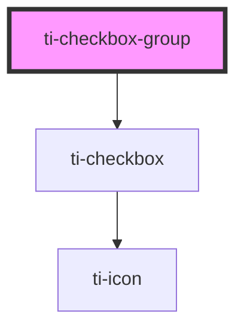

# ti-checkbox-group

<!-- Auto Generated Below -->

## Properties

| Property        | Attribute        | Description      | Type                             | Default                   |
| --------------- | ---------------- | ---------------- | -------------------------------- | ------------------------- |
| `color`         | `color`          | 单选框颜色配置          | `string`                         | `undefined`               |
| `defaultValue`  | --               | 默认选中的值           | `(string \| number)[]`           | `null`                    |
| `direction`     | `direction`      | 子组件排列方向          | `"horizontal" \| "vertical"`     | `'horizontal'`            |
| `disabled`      | `disabled`       | 指定当前是否禁用         | `boolean`                        | `false`                   |
| `extClass`      | `ext-class`      | 额外的类名，添加到根节点的元素上 | `string`                         | `undefined`               |
| `extStyle`      | --               | 额外的样式            | `{}`                             | `{}`                      |
| `icon`          | `icon`           | 自定义图标名称          | `string`                         | `undefined`               |
| `labelDisabled` | `label-disabled` | 指定当前文字是否禁用点击     | `boolean`                        | `false`                   |
| `max`           | `max`            | 设置当前最多选择的数量      | `number`                         | `Number.MAX_SAFE_INTEGER` |
| `options`       | --               | 以配置形式设置子元素       | `CheckboxItem[]`                 | `[]`                      |
| `shape`         | `shape`          | 单选框圆角度数          | `"circle" \| "none" \| "square"` | `'circle'`                |
| `size`          | `size`           | 多选框尺寸            | `number`                         | `undefined`               |
| `value`         | --               | 用于指定当前选中的选项      | `(string \| number)[]`           | `null`                    |

## Events

| Event       | Description | Type                                |
| ----------- | ----------- | ----------------------------------- |
| `change`    |             | `CustomEvent<(string \| number)[]>` |
| `handleMax` |             | `CustomEvent<never>`                |

## Methods

### `getInstance() => Promise<this>`

#### Returns

Type: `Promise<this>`

## Dependencies

### Depends on

- [ti-checkbox](../checkbox)

### Graph

----------------------------------------------

*Built with [StencilJS](https://stenciljs.com/)*
