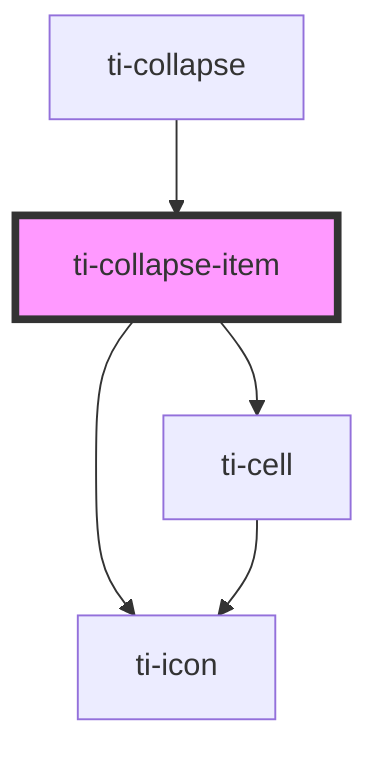

# ti-collapse

<!-- Auto Generated Below -->

## Properties

| Property           | Attribute             | Description | Type                                   | Default     |
| ------------------ | --------------------- | ----------- | -------------------------------------- | ----------- |
| `clickable`        | `clickable`           |             | `boolean`                              | `true`      |
| `desc`             | `desc`                |             | `string`                               | `undefined` |
| `disabled`         | `disabled`            |             | `boolean`                              | `undefined` |
| `extClass`         | `ext-class`           |             | `string`                               | `''`        |
| `extContentClass`  | `ext-content-class`   |             | `string`                               | `''`        |
| `extStyle`         | `ext-style`           |             | `string \| { [key: string]: string; }` | `undefined` |
| `icon`             | `icon`                |             | `string`                               | `undefined` |
| `label`            | `label`               |             | `string`                               | `undefined` |
| `rightIcon`        | `right-icon`          |             | `string`                               | `undefined` |
| `title`            | `title`               |             | `string`                               | `''`        |
| `useRightIconSlot` | `use-right-icon-slot` |             | `boolean`                              | `undefined` |
| `value`            | `value`               |             | `number \| string`                     | `undefined` |

## Methods

### `updateDataFromParent() => Promise<void>`

#### Returns

Type: `Promise<void>`

## Dependencies

### Used by

 - [ti-collapse](../collapse)

### Depends on

- [ti-cell](../cell)
- [ti-icon](../icon)

### Graph

----------------------------------------------

*Built with [StencilJS](https://stenciljs.com/)*
