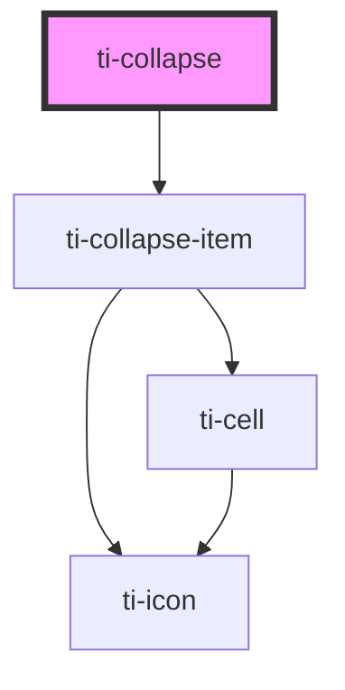

# ti-collapse

<!-- Auto Generated Below -->

## Properties

| Property                | Attribute                  | Description | Type                                                                                     | Default     |
| ----------------------- | -------------------------- | ----------- | ---------------------------------------------------------------------------------------- | ----------- |
| `clickable`             | `clickable`                |             | `boolean`                                                                                | `undefined` |
| `disabled`              | `disabled`                 |             | `boolean`                                                                                | `undefined` |
| `extOptionClass`        | `ext-option-class`         |             | `string`                                                                                 | `''`        |
| `extOptionContentClass` | `ext-option-content-class` |             | `string`                                                                                 | `''`        |
| `extOptionStyle`        | `ext-option-style`         |             | `string \| { [key: string]: string; }`                                                   | `undefined` |
| `icon`                  | `icon`                     |             | `string`                                                                                 | `undefined` |
| `options`               | `options`                  |             | `((OmitType<TiCollapseItem, (...agrn: any) => any> & { content: string; })[]) \| string` | `[]`        |
| `repel`                 | `repel`                    |             | `boolean`                                                                                | `undefined` |
| `rightIcon`             | `right-icon`               |             | `string`                                                                                 | `undefined` |
| `value`                 | --                         |             | `unknown`                                                                                | `undefined` |

## Events

| Event    | Description | Type                   |
| -------- | ----------- | ---------------------- |
| `change` |             | `CustomEvent<unknown>` |
| `close`  |             | `CustomEvent<unknown>` |
| `open`   |             | `CustomEvent<unknown>` |

## Methods

### `getImperativeHandle() => Promise<{ children: HTMLTiCollapseItemElement[]; selectValue: string | number | (string | number)[]; }>`

#### Returns

Type: `Promise<{ children: HTMLTiCollapseItemElement[]; selectValue: string | number | (string | number)[]; }>`

### `switch(name: string | number, status: boolean) => Promise<void>`

#### Returns

Type: `Promise<void>`

## Dependencies

### Depends on

- [ti-collapse-item](../collapse-item)

### Graph

----------------------------------------------

*Built with [StencilJS](https://stenciljs.com/)*
