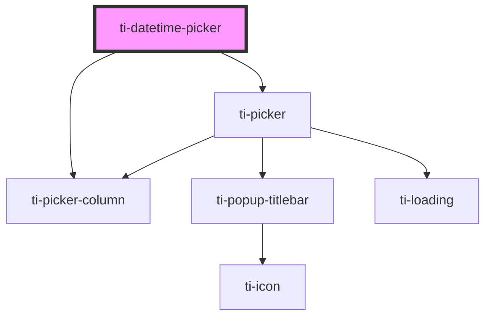

# ti-datetime-picker

<!-- Auto Generated Below -->

## Properties

| Property             | Attribute               | Description | Type                                                                                                                                                                                        | Default                         |
| -------------------- | ----------------------- | ----------- | ------------------------------------------------------------------------------------------------------------------------------------------------------------------------------------------- | ------------------------------- |
| `cancelText`         | `cancel-text`           |             | `string`                                                                                                                                                                                    | `undefined`                     |
| `confirmText`        | `confirm-text`          |             | `string`                                                                                                                                                                                    | `undefined`                     |
| `extClass`           | `ext-class`             |             | `string`                                                                                                                                                                                    | `''`                            |
| `extHairlineClass`   | `ext-hairline-class`    |             | `string`                                                                                                                                                                                    | `''`                            |
| `extMaskClass`       | `ext-mask-class`        |             | `string`                                                                                                                                                                                    | `''`                            |
| `extOptionClass`     | `ext-option-class`      |             | `string`                                                                                                                                                                                    | `''`                            |
| `extOptionItemClass` | `ext-option-item-class` |             | `string`                                                                                                                                                                                    | `''`                            |
| `extOptionStyle`     | `ext-option-style`      |             | `string \| { [key: string]: string; }`                                                                                                                                                      | `undefined`                     |
| `extStyle`           | `ext-style`             |             | `string \| { [key: string]: string; }`                                                                                                                                                      | `undefined`                     |
| `filter`             | --                      |             | `(type: DateTimePickerColumnEnum, values: { [x: string]: unknown; value: number; }[], params: { day: unknown; hour: unknown; minute: unknown; year: unknown; month: unknown; }) => unknown` | `undefined`                     |
| `formatter`          | --                      |             | `(type: DateTimePickerColumnEnum, value: number, params: { day: unknown; hour: unknown; minute: unknown; year: unknown; month: unknown; }) => unknown`                                      | `undefined`                     |
| `label`              | `label`                 |             | `string`                                                                                                                                                                                    | `defaultProps.label`            |
| `loading`            | `loading`               |             | `boolean`                                                                                                                                                                                   | `undefined`                     |
| `maxDate`            | `max-date`              |             | `number`                                                                                                                                                                                    | `defaultProps.maxDate`          |
| `minDate`            | `min-date`              |             | `number`                                                                                                                                                                                    | `defaultProps.minDate`          |
| `optionItemHeight`   | `option-item-height`    |             | `number \| string`                                                                                                                                                                          | `defaultProps.optionItemHeight` |
| `sort`               | --                      |             | `DateTimePickerColumnEnum[]`                                                                                                                                                                | `defaultProps.sort`             |
| `subTitle`           | `sub-title`             |             | `string`                                                                                                                                                                                    | `undefined`                     |
| `title`              | `title`                 |             | `string`                                                                                                                                                                                    | `defaultProps.title`            |
| `type`               | `type`                  |             | `"date" \| "datetime" \| "time" \| "year-month"`                                                                                                                                            | `defaultProps.type`             |
| `value`              | --                      |             | `unknown`                                                                                                                                                                                   | `undefined`                     |
| `visibleItemCount`   | `visible-item-count`    |             | `number`                                                                                                                                                                                    | `defaultProps.visibleItemCount` |

## Events

| Event     | Description | Type                   |
| --------- | ----------- | ---------------------- |
| `cancel`  |             | `CustomEvent<unknown>` |
| `change`  |             | `CustomEvent<unknown>` |
| `confirm` |             | `CustomEvent<unknown>` |

## Dependencies

### Depends on

- [ti-picker](../picker)
- [ti-picker-column](../picker-column)

### Graph

----------------------------------------------

*Built with [StencilJS](https://stenciljs.com/)*
