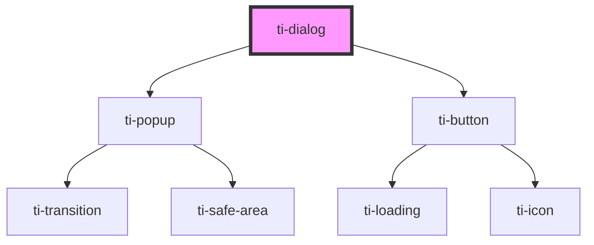

# ti-dialog

<!-- Auto Generated Below -->

## Properties

| Property                | Attribute                  | Description | Type                                   | Default     |
| ----------------------- | -------------------------- | ----------- | -------------------------------------- | ----------- |
| `cancelBtnText`         | `cancel-btn-text`          |             | `string`                               | `'取消'`      |
| `cancelButtonColor`     | `cancel-button-color`      |             | `string`                               | `undefined` |
| `confirmBtnText`        | `confirm-btn-text`         |             | `string`                               | `'确定'`      |
| `confirmButtonColor`    | `confirm-button-color`     |             | `string`                               | `undefined` |
| `content`               | `content`                  |             | `string`                               | `''`        |
| `extActionCancelClass`  | `ext-action-cancel-class`  |             | `string`                               | `''`        |
| `extActionConfirmClass` | `ext-action-confirm-class` |             | `string`                               | `''`        |
| `extActionsClass`       | `ext-actions-class`        |             | `string`                               | `''`        |
| `extClass`              | `ext-class`                |             | `string`                               | `''`        |
| `extContentClass`       | `ext-content-class`        |             | `string`                               | `''`        |
| `extInnerClass`         | `ext-inner-class`          |             | `string`                               | `''`        |
| `extPopupClass`         | `ext-popup-class`          |             | `string`                               | `''`        |
| `extPopupContentClass`  | `ext-popup-content-class`  |             | `string`                               | `''`        |
| `extPopupMaskClass`     | `ext-popup-mask-class`     |             | `string`                               | `''`        |
| `extStyle`              | `ext-style`                |             | `string \| { [key: string]: string; }` | `undefined` |
| `hasCancelButton`       | `has-cancel-button`        |             | `boolean`                              | `true`      |
| `isTextButton`          | `is-text-button`           |             | `boolean`                              | `false`     |
| `preventDefault`        | `prevent-default`          |             | `boolean`                              | `false`     |
| `title`                 | `title`                    |             | `string`                               | `''`        |
| `useActionsSlot`        | `use-actions-slot`         |             | `boolean`                              | `false`     |
| `useContentSlot`        | `use-content-slot`         |             | `boolean`                              | `false`     |
| `visible`               | `visible`                  |             | `boolean`                              | `false`     |

## Events

| Event     | Description | Type                |
| --------- | ----------- | ------------------- |
| `cancel`  |             | `CustomEvent<any>`  |
| `close`   |             | `CustomEvent<any>`  |
| `confirm` |             | `CustomEvent<any>`  |
| `exited`  |             | `CustomEvent<null>` |

## Methods

### `close() => Promise<void>`

#### Returns

Type: `Promise<void>`

### `show(opts: IDialogStaticOptions) => Promise<void>`

#### Returns

Type: `Promise<void>`

## Dependencies

### Depends on

- [ti-popup](../popup)
- [ti-button](../button)

### Graph

----------------------------------------------

*Built with [StencilJS](https://stenciljs.com/)*
