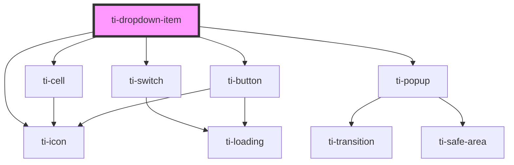

# ti-dropdown-item

<!-- Auto Generated Below -->

## Properties

| Property             | Attribute       | Description      | Type                                       | Default      |
| -------------------- | --------------- | ---------------- | ------------------------------------------ | ------------ |
| `activeColor`        | `active-color`  |                  | `string`                                   | `undefined`  |
| `closeOnMask`        | `close-on-mask` |                  | `boolean`                                  | `true`       |
| `direction`          | `direction`     |                  | `"down" \| "up"`                           | `'down'`     |
| `disabled`           | `disabled`      |                  | `boolean`                                  | `false`      |
| `extClass`           | `ext-class`     | 额外的类名，添加到根节点的元素上 | `string`                                   | `undefined`  |
| `hasMask`            | `has-mask`      |                  | `boolean`                                  | `true`       |
| `hasSubmit`          | `has-submit`    |                  | `boolean`                                  | `undefined`  |
| `icon`               | `icon`          |                  | `string`                                   | `'selected'` |
| `mode`               | `mode`          |                  | `"multiple" \| "single"`                   | `'single'`   |
| `options`            | --              |                  | `TiDropdownItemOption[]`                   | `[]`         |
| `submitText`         | `submit-text`   |                  | `string`                                   | `'确定'`       |
| `title` _(required)_ | `title`         |                  | `string`                                   | `undefined`  |
| `type`               | `type`          |                  | `"checkbox" \| "switch"`                   | `'checkbox'` |
| `value`              | `value`         |                  | `(string \| number)[] \| number \| string` | `''`         |
| `visible`            | `visible`       |                  | `boolean`                                  | `false`      |

## Events

| Event    | Description | Type                                                    |
| -------- | ----------- | ------------------------------------------------------- |
| `change` |             | `CustomEvent<(string \| number)[] \| number \| string>` |
| `close`  |             | `CustomEvent<never>`                                    |
| `open`   |             | `CustomEvent<never>`                                    |
| `submit` |             | `CustomEvent<(string \| number)[] \| number \| string>` |

## Methods

### `getInstance() => Promise<this>`

#### Returns

Type: `Promise<this>`

### `toggle() => Promise<void>`

#### Returns

Type: `Promise<void>`

## Dependencies

### Depends on

- [ti-icon](../icon)
- [ti-switch](../switch)
- [ti-cell](../cell)
- [ti-popup](../popup)
- [ti-button](../button)

### Graph

----------------------------------------------

*Built with [StencilJS](https://stenciljs.com/)*
