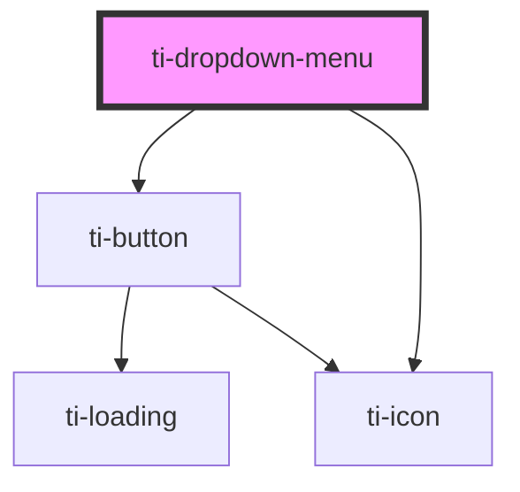

# ti-dropdown-menu

<!-- Auto Generated Below -->

## Properties

| Property      | Attribute       | Description      | Type                     | Default     |
| ------------- | --------------- | ---------------- | ------------------------ | ----------- |
| `activeColor` | `active-color`  |                  | `string`                 | `undefined` |
| `closeOnMask` | `close-on-mask` |                  | `boolean`                | `true`      |
| `direction`   | `direction`     |                  | `"down" \| "up"`         | `undefined` |
| `disabled`    | `disabled`      |                  | `boolean`                | `null`      |
| `extClass`    | `ext-class`     | 额外的类名，添加到根节点的元素上 | `string`                 | `''`        |
| `hasMask`     | `has-mask`      |                  | `boolean`                | `true`      |
| `icon`        | `icon`          |                  | `string`                 | `undefined` |
| `mode`        | `mode`          |                  | `"multiple" \| "single"` | `'single'`  |
| `type`        | --              |                  | `null`                   | `undefined` |

## Events

| Event   | Description | Type                 |
| ------- | ----------- | -------------------- |
| `close` |             | `CustomEvent<never>` |
| `open`  |             | `CustomEvent<never>` |

## Methods

### `getInstance() => Promise<this>`

#### Returns

Type: `Promise<this>`

## Dependencies

### Depends on

- [ti-button](../button)
- [ti-icon](../icon)

### Graph

----------------------------------------------

*Built with [StencilJS](https://stenciljs.com/)*
