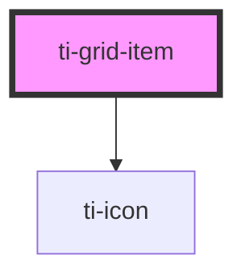

# ti-grid-item

<!-- Auto Generated Below -->

## Properties

| Property        | Attribute        | Description      | Type      | Default     |
| --------------- | ---------------- | ---------------- | --------- | ----------- |
| `color`         | `color`          | 文字颜色             | `string`  | `undefined` |
| `contentClass`  | `content-class`  |                  | `string`  | `undefined` |
| `customContent` | `custom-content` | 是否自定义内容          | `boolean` | `false`     |
| `extClass`      | `ext-class`      | 额外的类名，添加到根节点的元素上 | `string`  | `undefined` |
| `icon`          | `icon`           | 图标               | `string`  | `undefined` |
| `iconClass`     | `icon-class`     |                  | `string`  | `undefined` |
| `size`          | `size`           | 图标尺寸             | `number`  | `undefined` |
| `text`          | `text`           | 文字内容             | `string`  | `undefined` |
| `textClass`     | `text-class`     |                  | `string`  | `undefined` |

## Methods

### `updateDataFromParent(parent?: HTMLTiGridElement | Components.TiGrid) => Promise<void>`

#### Returns

Type: `Promise<void>`

## Dependencies

### Depends on

- [ti-icon](../icon)

### Graph

----------------------------------------------

*Built with [StencilJS](https://stenciljs.com/)*
