# ti-icon

<!-- Auto Generated Below -->

## Properties

| Property    | Attribute    | Description | Type                                   | Default     |
| ----------- | ------------ | ----------- | -------------------------------------- | ----------- |
| `color`     | `color`      |             | `string`                               | `undefined` |
| `extClass`  | `ext-class`  |             | `string`                               | `undefined` |
| `extStyle`  | `ext-style`  |             | `string \| { [key: string]: string; }` | `undefined` |
| `hyphen`    | `hyphen`     |             | `string`                               | `'-'`       |
| `iconStyle` | `icon-style` |             | `string`                               | `undefined` |
| `name`      | `name`       |             | `string`                               | `undefined` |
| `prefix`    | `prefix`     |             | `string`                               | `undefined` |
| `rotate`    | `rotate`     |             | `string`                               | `undefined` |
| `size`      | `size`       |             | `number \| string`                     | `undefined` |
| `spin`      | `spin`       |             | `boolean`                              | `undefined` |

## Dependencies

### Used by

 - [ti-action-sheet](../action-sheet)
 - [ti-back-top](../back-top)
 - [ti-badge](../badge)
 - [ti-button](../button)
 - [ti-cell](../cell)
 - [ti-checkbox](../checkbox)
 - [ti-choose](../uploader)
 - [ti-collapse-item](../collapse-item)
 - [ti-dropdown-item](../dropdown-item)
 - [ti-dropdown-menu](../dropdown-menu)
 - [ti-grid-item](../grid-item)
 - [ti-image](../image)
 - [ti-input](../input)
 - [ti-input-number](../input-number)
 - [ti-notice-bar](../notice-bar)
 - [ti-popup-titlebar](../popup-titlebar)
 - [ti-preview](../preview)
 - [ti-radio](../radio)
 - [ti-rate](../rate)
 - [ti-search](../search)
 - [ti-share-sheet](../share-sheet)
 - [ti-steps](../steps)
 - [ti-tabbar-item](../tabbar-item)
 - [ti-tag](../tag)
 - [ti-thumbnail](../uploader)
 - [ti-toast](../toast)
 - [ti-tree-select](../tree-select)

### Graph

```mermaid
graph TD;
  ti-action-sheet --> ti-icon
  ti-back-top --> ti-icon
  ti-badge --> ti-icon
  ti-button --> ti-icon
  ti-cell --> ti-icon
  ti-checkbox --> ti-icon
  ti-choose --> ti-icon
  ti-collapse-item --> ti-icon
  ti-dropdown-item --> ti-icon
  ti-dropdown-menu --> ti-icon
  ti-grid-item --> ti-icon
  ti-image --> ti-icon
  ti-input --> ti-icon
  ti-input-number --> ti-icon
  ti-notice-bar --> ti-icon
  ti-popup-titlebar --> ti-icon
  ti-preview --> ti-icon
  ti-radio --> ti-icon
  ti-rate --> ti-icon
  ti-search --> ti-icon
  ti-share-sheet --> ti-icon
  ti-steps --> ti-icon
  ti-tabbar-item --> ti-icon
  ti-tag --> ti-icon
  ti-thumbnail --> ti-icon
  ti-toast --> ti-icon
  ti-tree-select --> ti-icon
  style ti-icon fill:#f9f,stroke:#333,stroke-width:4px
```

----------------------------------------------

*Built with [StencilJS](https://stenciljs.com/)*
