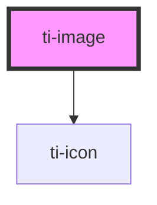

# ti-image

<!-- Auto Generated Below -->

## Properties

| Property          | Attribute           | Description      | Type                                                                                                                                                                                                                                                                                                                                                                                                                                                                                                    | Default                       |
| ----------------- | ------------------- | ---------------- | ------------------------------------------------------------------------------------------------------------------------------------------------------------------------------------------------------------------------------------------------------------------------------------------------------------------------------------------------------------------------------------------------------------------------------------------------------------------------------------------------------- | ----------------------------- |
| `alt`             | `alt`               |                  | `string`                                                                                                                                                                                                                                                                                                                                                                                                                                                                                                | `undefined`                   |
| `errorIcon`       | `error-icon`        |                  | `string`                                                                                                                                                                                                                                                                                                                                                                                                                                                                                                | `'default-pic'`               |
| `errorIconSize`   | `error-icon-size`   |                  | `number`                                                                                                                                                                                                                                                                                                                                                                                                                                                                                                | `72`                          |
| `extClass`        | `ext-class`         | 额外的类名，添加到根节点的元素上 | `string`                                                                                                                                                                                                                                                                                                                                                                                                                                                                                                | `''`                          |
| `extStyle`        | `ext-style`         | 额外的样式            | `string`                                                                                                                                                                                                                                                                                                                                                                                                                                                                                                | `undefined`                   |
| `height`          | `height`            |                  | `number \| string`                                                                                                                                                                                                                                                                                                                                                                                                                                                                                      | `240`                         |
| `lazyLoad`        | `lazy-load`         |                  | `boolean`                                                                                                                                                                                                                                                                                                                                                                                                                                                                                               | `undefined`                   |
| `loadingIcon`     | `loading-icon`      |                  | `string`                                                                                                                                                                                                                                                                                                                                                                                                                                                                                                | `'default-pic'`               |
| `loadingIconSize` | `loading-icon-size` |                  | `number`                                                                                                                                                                                                                                                                                                                                                                                                                                                                                                | `72`                          |
| `mode`            | `mode`              |                  | `ImageModeEnum.ASPECT_FILL \| ImageModeEnum.ASPECT_FIT \| ImageModeEnum.BOTTOM \| ImageModeEnum.BOTTOM_LEFT \| ImageModeEnum.BOTTOM_RIGHT \| ImageModeEnum.CENTER \| ImageModeEnum.CONTAIN \| ImageModeEnum.COVER \| ImageModeEnum.FILL \| ImageModeEnum.HEIGHT_FIX \| ImageModeEnum.LEFT \| ImageModeEnum.NONE \| ImageModeEnum.RIGHT \| ImageModeEnum.SCALE_DOWN \| ImageModeEnum.SCALE_TO_FILL \| ImageModeEnum.TOP \| ImageModeEnum.TOP_LEFT \| ImageModeEnum.TOP_RIGHT \| ImageModeEnum.WIDTH_FIX` | `ImageModeEnum.SCALE_TO_FILL` |
| `radius`          | `radius`            |                  | `number \| string`                                                                                                                                                                                                                                                                                                                                                                                                                                                                                      | `undefined`                   |
| `showError`       | `show-error`        |                  | `boolean`                                                                                                                                                                                                                                                                                                                                                                                                                                                                                               | `true`                        |
| `showLoading`     | `show-loading`      |                  | `boolean`                                                                                                                                                                                                                                                                                                                                                                                                                                                                                               | `true`                        |
| `src`             | `src`               |                  | `string`                                                                                                                                                                                                                                                                                                                                                                                                                                                                                                | `undefined`                   |
| `useErrorSlot`    | `use-error-slot`    |                  | `boolean`                                                                                                                                                                                                                                                                                                                                                                                                                                                                                               | `undefined`                   |
| `useLoadingSlot`  | `use-loading-slot`  |                  | `boolean`                                                                                                                                                                                                                                                                                                                                                                                                                                                                                               | `undefined`                   |
| `width`           | `width`             |                  | `number \| string`                                                                                                                                                                                                                                                                                                                                                                                                                                                                                      | `320`                         |

## Events

| Event   | Description | Type                                              |
| ------- | ----------- | ------------------------------------------------- |
| `click` |             | `CustomEvent<never>`                              |
| `error` |             | `CustomEvent<never>`                              |
| `load`  |             | `CustomEvent<{ width: number; height: number; }>` |

## Dependencies

### Depends on

- [ti-icon](../icon)

### Graph

----------------------------------------------

*Built with [StencilJS](https://stenciljs.com/)*
