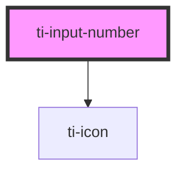

# ti-input-number

<!-- Auto Generated Below -->

## Properties

| Property        | Attribute         | Description      | Type                | Default                   |
| --------------- | ----------------- | ---------------- | ------------------- | ------------------------- |
| `asyncChange`   | `async-change`    |                  | `boolean`           | `undefined`               |
| `autoWidth`     | `auto-width`      |                  | `boolean`           | `undefined`               |
| `border`        | `border`          |                  | `boolean`           | `undefined`               |
| `disabled`      | `disabled`        |                  | `boolean`           | `undefined`               |
| `disabledInput` | `disabled-input`  |                  | `boolean`           | `undefined`               |
| `extClass`      | `ext-class`       | 额外的类名，添加到根节点的元素上 | `string`            | `''`                      |
| `extInputClass` | `ext-input-class` |                  | `string`            | `''`                      |
| `extMinusClass` | `ext-minus-class` |                  | `string`            | `''`                      |
| `extPlusClass`  | `ext-plus-class`  |                  | `string`            | `''`                      |
| `extStyle`      | `ext-style`       | 额外的样式            | `string`            | `''`                      |
| `inputWidth`    | `input-width`     |                  | `number`            | `undefined`               |
| `max`           | `max`             |                  | `number`            | `Number.MAX_SAFE_INTEGER` |
| `min`           | `min`             |                  | `number`            | `Number.MIN_SAFE_INTEGER` |
| `round`         | `round`           |                  | `boolean`           | `undefined`               |
| `size`          | `size`            |                  | `"big" \| "medium"` | `undefined`               |
| `step`          | `step`            |                  | `number`            | `1`                       |
| `thumbnail`     | `thumbnail`       |                  | `boolean`           | `undefined`               |
| `value`         | `value`           |                  | `number \| string`  | `0`                       |
| `variant`       | `variant`         |                  | `"block" \| "pure"` | `undefined`               |

## Events

| Event    | Description | Type                              |
| -------- | ----------- | --------------------------------- |
| `blur`   |             | `CustomEvent<{ value: number; }>` |
| `change` |             | `CustomEvent<number>`             |
| `focus`  |             | `CustomEvent<{ value: number; }>` |
| `minus`  |             | `CustomEvent<number>`             |
| `plus`   |             | `CustomEvent<number>`             |

## Dependencies

### Depends on

- [ti-icon](../icon)

### Graph

----------------------------------------------

*Built with [StencilJS](https://stenciljs.com/)*
