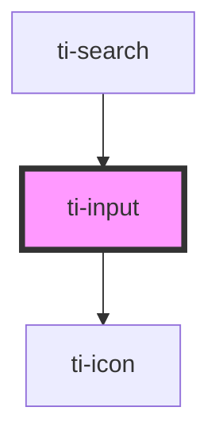

# ti-input

<!-- Auto Generated Below -->

## Properties

| Property        | Attribute         | Description      | Type                                               | Default     |
| --------------- | ----------------- | ---------------- | -------------------------------------------------- | ----------- |
| `autofocus`     | `autofocus`       |                  | `boolean`                                          | `undefined` |
| `clearable`     | `clearable`       |                  | `boolean`                                          | `true`      |
| `confirmType`   | `confirm-type`    |                  | `"done" \| "go" \| "next" \| "search" \| "send"`   | `undefined` |
| `disabled`      | `disabled`        |                  | `boolean`                                          | `undefined` |
| `divider`       | `divider`         |                  | `boolean`                                          | `true`      |
| `ellipsisLine`  | `ellipsis-line`   |                  | `number`                                           | `0`         |
| `error`         | `error`           |                  | `boolean`                                          | `undefined` |
| `errorMessage`  | `error-message`   |                  | `string`                                           | `undefined` |
| `extClass`      | `ext-class`       | 额外的类名，添加到根节点的元素上 | `string`                                           | `''`        |
| `extStyle`      | `ext-style`       | 额外的样式            | `string`                                           | `''`        |
| `inputClass`    | `input-class`     |                  | `string`                                           | `''`        |
| `label`         | `label`           |                  | `string`                                           | `undefined` |
| `labelClass`    | `label-class`     |                  | `string`                                           | `''`        |
| `maxlength`     | `maxlength`       |                  | `number`                                           | `140`       |
| `placeholder`   | `placeholder`     |                  | `string`                                           | `undefined` |
| `prefixIcon`    | `prefix-icon`     |                  | `string`                                           | `undefined` |
| `readOnly`      | `read-only`       |                  | `boolean`                                          | `undefined` |
| `required`      | `required`        |                  | `boolean`                                          | `undefined` |
| `showClearIcon` | `show-clear-icon` |                  | `boolean`                                          | `undefined` |
| `textAlign`     | `text-align`      |                  | `"left" \| "right"`                                | `undefined` |
| `type`          | `type`            |                  | `"digit" \| "number" \| "safe-password" \| "text"` | `undefined` |
| `value`         | `value`           |                  | `string`                                           | `undefined` |

## Events

| Event     | Description | Type                        |
| --------- | ----------- | --------------------------- |
| `blur`    |             | `CustomEvent<EventDetails>` |
| `change`  |             | `CustomEvent<EventDetails>` |
| `clear`   |             | `CustomEvent<never>`        |
| `click`   |             | `CustomEvent<never>`        |
| `confirm` |             | `CustomEvent<EventDetails>` |
| `focus`   |             | `CustomEvent<EventDetails>` |
| `input`   |             | `CustomEvent<EventDetails>` |

## Dependencies

### Used by

 - [ti-search](../search)

### Depends on

- [ti-icon](../icon)

### Graph

----------------------------------------------

*Built with [StencilJS](https://stenciljs.com/)*
