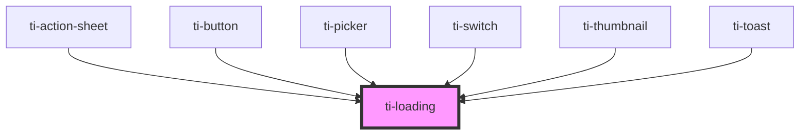

# ti-loading

<!-- Auto Generated Below -->

## Properties

| Property    | Attribute   | Description      | Type                      | Default      |
| ----------- | ----------- | ---------------- | ------------------------- | ------------ |
| `color`     | `color`     |                  | `string`                  | `undefined`  |
| `direction` | `direction` | 图标颜色             | `string`                  | `'row'`      |
| `extClass`  | `ext-class` | 额外的类名，添加到根节点的元素上 | `string`                  | `''`         |
| `mode`      | `mode`      | loading 展示模式     | `"circular" \| "spinner"` | `'circular'` |
| `size`      | `size`      | loading 尺寸       | `number`                  | `72`         |
| `text`      | `text`      | 加载文字             | `string`                  | `''`         |

## Dependencies

### Used by

 - [ti-action-sheet](../action-sheet)
 - [ti-button](../button)
 - [ti-picker](../picker)
 - [ti-switch](../switch)
 - [ti-thumbnail](../uploader)
 - [ti-toast](../toast)

### Graph

----------------------------------------------

*Built with [StencilJS](https://stenciljs.com/)*
