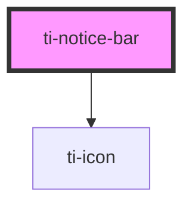

# ti-notice-bar

<!-- Auto Generated Below -->

## Properties

| Property     | Attribute    | Description      | Type                         | Default         |
| ------------ | ------------ | ---------------- | ---------------------------- | --------------- |
| `color`      | `color`      |                  | `string`                     | `undefined`     |
| `content`    | `content`    |                  | `string \| string[]`         | `''`            |
| `extClass`   | `ext-class`  | 额外的类名，添加到根节点的元素上 | `string`                     | `undefined`     |
| `extStyle`   | --           | 额外的样式            | `{}`                         | `{}`            |
| `leftIcon`   | `left-icon`  |                  | `string`                     | `'speaker'`     |
| `rightIcon`  | `right-icon` |                  | `string`                     | `'arrow-right'` |
| `scrollable` | `scrollable` |                  | `boolean \| string`          | `''`            |
| `speed`      | `speed`      |                  | `number`                     | `50`            |
| `variant`    | `variant`    |                  | `"horizontal" \| "vertical"` | `'horizontal'`  |

## Events

| Event   | Description | Type                 |
| ------- | ----------- | -------------------- |
| `click` |             | `CustomEvent<never>` |

## Methods

### `close() => Promise<void>`

#### Returns

Type: `Promise<void>`

## Dependencies

### Depends on

- [ti-icon](../icon)

### Graph

----------------------------------------------

*Built with [StencilJS](https://stenciljs.com/)*
