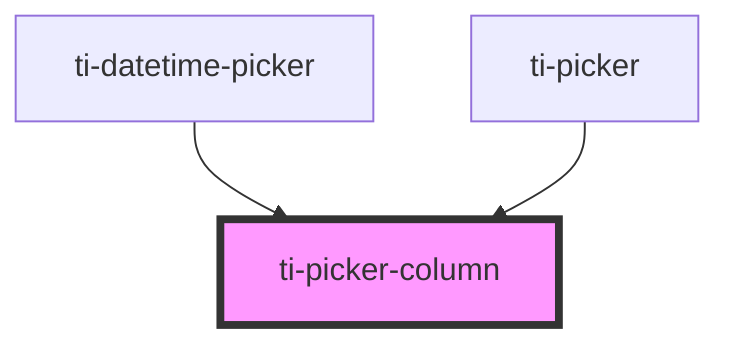

# ti-picker-column

<!-- Auto Generated Below -->

## Properties

| Property             | Attribute               | Description | Type                                   | Default            |
| -------------------- | ----------------------- | ----------- | -------------------------------------- | ------------------ |
| `colAlias`           | `col-alias`             |             | `string`                               | `''`               |
| `columns`            | --                      |             | `unknown[]`                            | `[]`               |
| `extClass`           | `ext-class`             |             | `string`                               | `''`               |
| `extOptionItemClass` | `ext-option-item-class` |             | `string`                               | `''`               |
| `extStyle`           | `ext-style`             |             | `string \| { [key: string]: string; }` | `undefined`        |
| `height`             | `height`                |             | `number`                               | `undefined`        |
| `label`              | `label`                 |             | `string`                               | `''`               |
| `row`                | `row`                   |             | `number`                               | `undefined`        |
| `rowAlias`           | `row-alias`             |             | `number \| string`                     | `''`               |
| `sports`             | `sports`                |             | `boolean`                              | `false`            |
| `top`                | `top`                   |             | `number`                               | `defaultProps.top` |
| `useRowIndex`        | `use-row-index`         |             | `boolean`                              | `undefined`        |
| `value`              | --                      |             | `unknown`                              | `undefined`        |
| `y`                  | `y`                     |             | `number`                               | `undefined`        |

## Events

| Event         | Description | Type                                                             |
| ------------- | ----------- | ---------------------------------------------------------------- |
| `reachBottom` |             | `CustomEvent<{ rowIndex: number; colAlias: string \| number; }>` |
| `reachTop`    |             | `CustomEvent<{ rowIndex: number; colAlias: string \| number; }>` |
| `select`      |             | `CustomEvent<{ rowIndex: number; colAlias: string \| number; }>` |

## Methods

### `calcDistance({ columns, value }: { columns: unknown[]; value: unknown; }) => Promise<void>`

#### Returns

Type: `Promise<void>`

## Dependencies

### Used by

 - [ti-datetime-picker](../datetime-picker)
 - [ti-picker](../picker)

### Graph

----------------------------------------------

*Built with [StencilJS](https://stenciljs.com/)*
