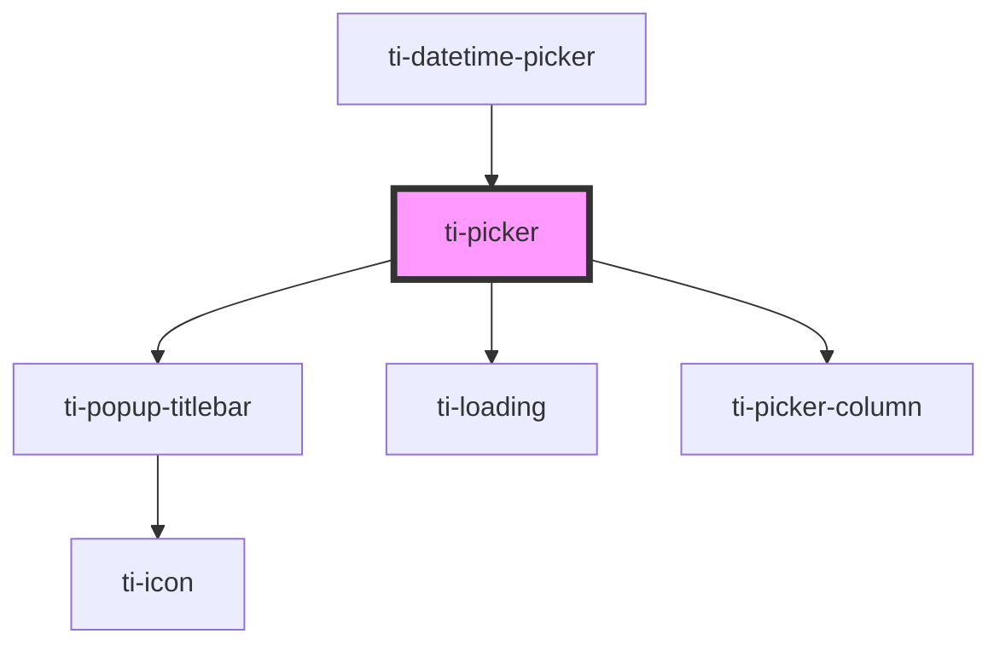

# ti-picker

<!-- Auto Generated Below -->

## Properties

| Property             | Attribute               | Description | Type                                   | Default                         |
| -------------------- | ----------------------- | ----------- | -------------------------------------- | ------------------------------- |
| `cancelText`         | `cancel-text`           |             | `string`                               | `defaultProps.cancelText`       |
| `cascade`            | --                      |             | `T`                                    | `defaultProps.cascade as T`     |
| `confirmText`        | `confirm-text`          |             | `string`                               | `defaultProps.confirmText`      |
| `extClass`           | `ext-class`             |             | `string`                               | `''`                            |
| `extHairlineClass`   | `ext-hairline-class`    |             | `string`                               | `''`                            |
| `extMaskClass`       | `ext-mask-class`        |             | `string`                               | `''`                            |
| `extOptionClass`     | `ext-option-class`      |             | `string`                               | `''`                            |
| `extOptionItemClass` | `ext-option-item-class` |             | `string`                               | `''`                            |
| `extOptionStyle`     | `ext-option-style`      |             | `string \| { [key: string]: string; }` | `undefined`                     |
| `extStyle`           | `ext-style`             |             | `string \| { [key: string]: string; }` | `undefined`                     |
| `label`              | `label`                 |             | `string`                               | `defaultProps.label`            |
| `loading`            | `loading`               |             | `boolean`                              | `false`                         |
| `optionItemHeight`   | `option-item-height`    |             | `number \| string`                     | `defaultProps.optionItemHeight` |
| `options`            | --                      |             | `any[]`                                | `[]`                            |
| `rowAlias`           | `row-alias`             |             | `number \| string`                     | `undefined`                     |
| `sports`             | `sports`                |             | `boolean`                              | `false`                         |
| `subTitle`           | `sub-title`             |             | `string`                               | `''`                            |
| `title`              | `title`                 |             | `string`                               | `defaultProps.title`            |
| `titlebar`           | `titlebar`              |             | `boolean`                              | `defaultProps.titlebar`         |
| `useRowIndex`        | `use-row-index`         |             | `boolean`                              | `false`                         |
| `value`              | --                      |             | `any[]`                                | `[]`                            |
| `visibleItemCount`   | `visible-item-count`    |             | `number`                               | `undefined`                     |

## Events

| Event         | Description | Type                   |
| ------------- | ----------- | ---------------------- |
| `cancel`      |             | `CustomEvent<unknown>` |
| `change`      |             | `CustomEvent<unknown>` |
| `confirm`     |             | `CustomEvent<unknown>` |
| `reachBottom` |             | `CustomEvent<unknown>` |
| `reachTop`    |             | `CustomEvent<unknown>` |

## Methods

### `getImperativeHandle() => Promise<{ children: HTMLTiPickerColumnElement[]; top: number; height: number; }>`

#### Returns

Type: `Promise<{ children: HTMLTiPickerColumnElement[]; top: number; height: number; }>`

### `onReachBottom(e: CustomEvent<{ rowIndex: number; colAlias: number | string; }>) => Promise<void>`

#### Returns

Type: `Promise<void>`

### `onReachTop(e: CustomEvent<{ rowIndex: number; colAlias: number | string; }>) => Promise<void>`

#### Returns

Type: `Promise<void>`

### `onSelect(e: CustomEvent<{ rowIndex: number; colAlias: string | number; }>) => Promise<void>`

#### Returns

Type: `Promise<void>`

### `updateColumn(colAlias: string | number, value: { value: unknown; options: unknown; rowIndex?: unknown; colIndex?: number; rowAlias?: unknown; }, inSelect?: boolean) => Promise<void>`

#### Returns

Type: `Promise<void>`

## Dependencies

### Used by

 - [ti-datetime-picker](../datetime-picker)

### Depends on

- [ti-popup-titlebar](../popup-titlebar)
- [ti-loading](../loading)
- [ti-picker-column](../picker-column)

### Graph

----------------------------------------------

*Built with [StencilJS](https://stenciljs.com/)*
