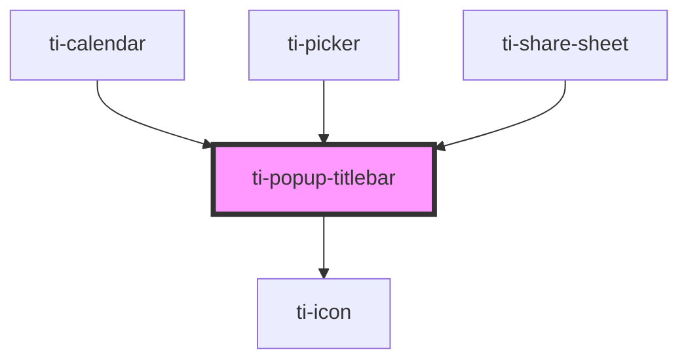

# ti-popup-titlebar

<!-- Auto Generated Below -->

## Properties

| Property      | Attribute      | Description      | Type                                   | Default                                 |
| ------------- | -------------- | ---------------- | -------------------------------------- | --------------------------------------- |
| `cancelText`  | `cancel-text`  |                  | `string`                               | `'取消'`                                  |
| `confirmText` | `confirm-text` |                  | `string`                               | `'确定'`                                  |
| `extClass`    | `ext-class`    | 额外的类名，添加到根节点的元素上 | `string`                               | `undefined`                             |
| `extStyle`    | `ext-style`    | 额外的样式            | `string \| { [key: string]: string; }` | `undefined`                             |
| `subTitle`    | `sub-title`    |                  | `string`                               | `undefined`                             |
| `title`       | `title`        |                  | `string`                               | `undefined`                             |
| `variant`     | `variant`      |                  | `string`                               | `EPopupTitleBarVariantType.WithConfirm` |

## Events

| Event     | Description | Type                |
| --------- | ----------- | ------------------- |
| `cancel`  |             | `CustomEvent<null>` |
| `close`   |             | `CustomEvent<null>` |
| `confirm` |             | `CustomEvent<null>` |

## Dependencies

### Used by

 - [ti-calendar](../calendar)
 - [ti-picker](../picker)
 - [ti-share-sheet](../share-sheet)

### Depends on

- [ti-icon](../icon)

### Graph

----------------------------------------------

*Built with [StencilJS](https://stenciljs.com/)*
