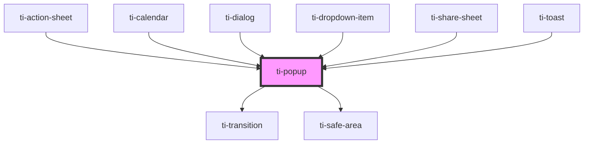

# ti-popup

<!-- Auto Generated Below -->

## Properties

| Property          | Attribute           | Description      | Type                                                                                                                                         | Default                   |
| ----------------- | ------------------- | ---------------- | -------------------------------------------------------------------------------------------------------------------------------------------- | ------------------------- |
| `closeOnMask`     | `close-on-mask`     |                  | `boolean`                                                                                                                                    | `true`                    |
| `contentZIndex`   | `content-z-index`   |                  | `number`                                                                                                                                     | `zIndexTool.getZIndex()`  |
| `destroyOnClose`  | `destroy-on-close`  |                  | `boolean`                                                                                                                                    | `false`                   |
| `extClass`        | `ext-class`         | 额外的类名，添加到根节点的元素上 | `string`                                                                                                                                     | `undefined`               |
| `extContentClass` | `ext-content-class` |                  | `string`                                                                                                                                     | `undefined`               |
| `extContentStyle` | `ext-content-style` |                  | `string \| { [key: string]: string; }`                                                                                                       | `undefined`               |
| `extMaskClass`    | `ext-mask-class`    |                  | `string`                                                                                                                                     | `undefined`               |
| `extMaskStyle`    | --                  |                  | `{}`                                                                                                                                         | `{}`                      |
| `extStyle`        | `ext-style`         | 额外的样式            | `string \| { [key: string]: string; }`                                                                                                       | `undefined`               |
| `hasMask`         | `has-mask`          |                  | `boolean`                                                                                                                                    | `true`                    |
| `maskZIndex`      | `mask-z-index`      |                  | `number`                                                                                                                                     | `zIndexTool.getZIndex()`  |
| `position`        | `position`          |                  | `string`                                                                                                                                     | `'center'`                |
| `preventScroll`   | `prevent-scroll`    |                  | `boolean`                                                                                                                                    | `false`                   |
| `radius`          | `radius`            |                  | `number \| string`                                                                                                                           | `''`                      |
| `safeArea`        | `safe-area`         |                  | `boolean`                                                                                                                                    | `true`                    |
| `timeout`         | `timeout`           |                  | `Timout \| number`                                                                                                                           | `300`                     |
| `timingFunction`  | `timing-function`   |                  | `string`                                                                                                                                     | `DEFAULT_TIMING_FUNCTION` |
| `transition`      | `transition`        |                  | `"fade" \| "fade-down" \| "fade-left" \| "fade-right" \| "fade-up" \| "slide-down" \| "slide-left" \| "slide-right" \| "slide-up" \| "zoom"` | `undefined`               |
| `visible`         | `visible`           |                  | `boolean`                                                                                                                                    | `false`                   |

## Events

| Event     | Description | Type                |
| --------- | ----------- | ------------------- |
| `close`   |             | `CustomEvent<null>` |
| `enter`   |             | `CustomEvent<null>` |
| `entered` |             | `CustomEvent<null>` |
| `exit`    |             | `CustomEvent<null>` |
| `exited`  |             | `CustomEvent<null>` |
| `show`    |             | `CustomEvent<null>` |

## Dependencies

### Used by

 - [ti-action-sheet](../action-sheet)
 - [ti-calendar](../calendar)
 - [ti-dialog](../dialog)
 - [ti-dropdown-item](../dropdown-item)
 - [ti-share-sheet](../share-sheet)
 - [ti-toast](../toast)

### Depends on

- [ti-transition](../transition)
- [ti-safe-area](../safe-area)

### Graph

----------------------------------------------

*Built with [StencilJS](https://stenciljs.com/)*
