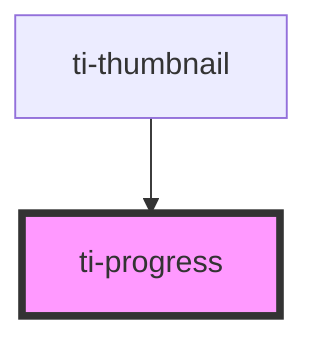

# ti-progress

<!-- Auto Generated Below -->

## Properties

| Property             | Attribute         | Description      | Type                      | Default     |
| -------------------- | ----------------- | ---------------- | ------------------------- | ----------- |
| `buffer`             | `buffer`          |                  | `number`                  | `0`         |
| `bufferBgColor`      | `buffer-bg-color` |                  | `string`                  | `''`        |
| `color`              | `color`           |                  | `string`                  | `''`        |
| `extClass`           | `ext-class`       | 额外的类名，添加到根节点的元素上 | `string`                  | `undefined` |
| `gradientColor`      | --                |                  | `TiProgressGradientColor` | `undefined` |
| `showProgress`       | `show-progress`   |                  | `boolean`                 | `undefined` |
| `strokeColor`        | `stroke-color`    |                  | `string`                  | `''`        |
| `strokeWidth`        | `stroke-width`    |                  | `number`                  | `4`         |
| `value` _(required)_ | `value`           |                  | `number`                  | `undefined` |

## Dependencies

### Used by

 - [ti-thumbnail](../uploader)

### Graph

----------------------------------------------

*Built with [StencilJS](https://stenciljs.com/)*
