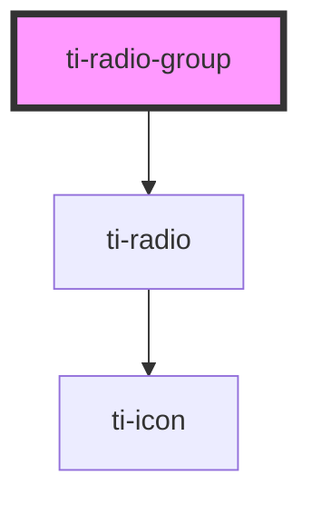

# ti-radio-group

<!-- Auto Generated Below -->

## Properties

| Property        | Attribute        | Description      | Type                             | Default     |
| --------------- | ---------------- | ---------------- | -------------------------------- | ----------- |
| `color`         | `color`          |                  | `string`                         | `undefined` |
| `defaultValue`  | `default-value`  |                  | `number \| string`               | `null`      |
| `direction`     | `direction`      |                  | `"column" \| "row"`              | `'row'`     |
| `disabled`      | `disabled`       |                  | `boolean`                        | `false`     |
| `extClass`      | `ext-class`      | 额外的类名，添加到根节点的元素上 | `string`                         | `undefined` |
| `icon`          | `icon`           |                  | `string`                         | `undefined` |
| `labelDisabled` | `label-disabled` |                  | `boolean`                        | `false`     |
| `options`       | --               |                  | `RadioItem[]`                    | `[]`        |
| `shape`         | `shape`          |                  | `"circle" \| "none" \| "square"` | `'circle'`  |
| `size`          | `size`           |                  | `number`                         | `undefined` |
| `value`         | `value`          |                  | `number \| string`               | `null`      |

## Events

| Event    | Description | Type                            |
| -------- | ----------- | ------------------------------- |
| `change` |             | `CustomEvent<number \| string>` |

## Methods

### `getInstance() => Promise<this>`

#### Returns

Type: `Promise<this>`

## Dependencies

### Depends on

- [ti-radio](../radio)

### Graph

----------------------------------------------

*Built with [StencilJS](https://stenciljs.com/)*
