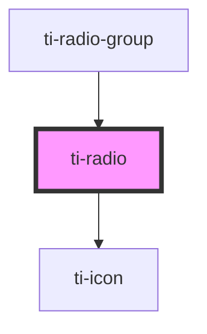

# ti-radio

<!-- Auto Generated Below -->

## Properties

| Property         | Attribute         | Description      | Type                             | Default             |
| ---------------- | ----------------- | ---------------- | -------------------------------- | ------------------- |
| `checked`        | `checked`         |                  | `boolean`                        | `null`              |
| `color`          | `color`           |                  | `string`                         | `undefined`         |
| `defaultChecked` | `default-checked` |                  | `boolean`                        | `null`              |
| `disabled`       | `disabled`        |                  | `boolean`                        | `false`             |
| `extClass`       | `ext-class`       | 额外的类名，添加到根节点的元素上 | `string`                         | `undefined`         |
| `icon`           | `icon`            |                  | `boolean \| string`              | `'checkbox-hollow'` |
| `label`          | `label`           |                  | `string`                         | `undefined`         |
| `labelDisabled`  | `label-disabled`  |                  | `boolean`                        | `false`             |
| `shape`          | `shape`           |                  | `"circle" \| "none" \| "square"` | `'circle'`          |
| `size`           | `size`            |                  | `number`                         | `32`                |
| `value`          | `value`           |                  | `number \| string`               | `null`              |

## Events

| Event    | Description | Type                   |
| -------- | ----------- | ---------------------- |
| `change` |             | `CustomEvent<boolean>` |

## Methods

### `updateDataFromParent(parent: ParentAttrs) => Promise<void>`

#### Returns

Type: `Promise<void>`

## Dependencies

### Used by

 - [ti-radio-group](../radio-group)

### Depends on

- [ti-icon](../icon)

### Graph

----------------------------------------------

*Built with [StencilJS](https://stenciljs.com/)*
