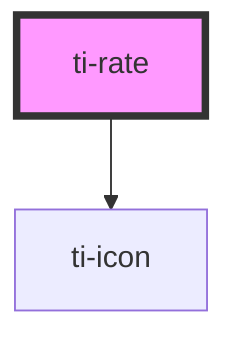

# ti-rate

<!-- Auto Generated Below -->

## Properties

| Property    | Attribute    | Description      | Type                                   | Default                 |
| ----------- | ------------ | ---------------- | -------------------------------------- | ----------------------- |
| `allowHalf` | `allow-half` |                  | `boolean`                              | `false`                 |
| `clearable` | `clearable`  |                  | `boolean`                              | `false`                 |
| `count`     | `count`      |                  | `number`                               | `5`                     |
| `disabled`  | `disabled`   |                  | `boolean`                              | `false`                 |
| `emptyIcon` | `empty-icon` |                  | `string`                               | `'rate-star-highlight'` |
| `extClass`  | `ext-class`  | 额外的类名，添加到根节点的元素上 | `string`                               | `undefined`             |
| `extStyle`  | `ext-style`  | 额外的样式            | `string \| { [key: string]: string; }` | `undefined`             |
| `gap`       | `gap`        |                  | `string`                               | `undefined`             |
| `icon`      | `icon`       |                  | `string`                               | `'rate-star-highlight'` |
| `iconSize`  | `icon-size`  |                  | `string`                               | `'36'`                  |
| `readOnly`  | `read-only`  |                  | `boolean`                              | `false`                 |
| `value`     | `value`      |                  | `number`                               | `0`                     |

## Events

| Event    | Description | Type                              |
| -------- | ----------- | --------------------------------- |
| `change` |             | `CustomEvent<{ value: number; }>` |

## Dependencies

### Depends on

- [ti-icon](../icon)

### Graph

----------------------------------------------

*Built with [StencilJS](https://stenciljs.com/)*
