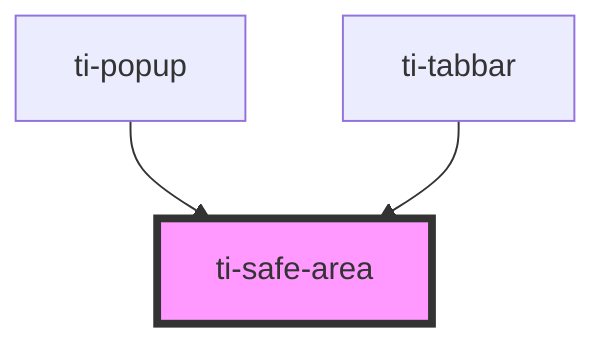

# ti-safe-area

<!-- Auto Generated Below -->

## Properties

| Property   | Attribute  | Description | Type                                | Default            |
| ---------- | ---------- | ----------- | ----------------------------------- | ------------------ |
| `position` | `position` |             | `ESafeArea.Bottom \| ESafeArea.Top` | `ESafeArea.Bottom` |

## Dependencies

### Used by

 - [ti-popup](../popup)
 - [ti-tabbar](../tabbar)

### Graph

----------------------------------------------

*Built with [StencilJS](https://stenciljs.com/)*
