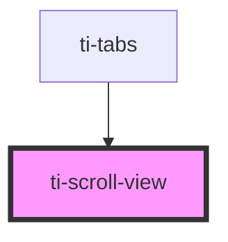

# ti-scroll-view

<!-- Auto Generated Below -->

## Properties

| Property              | Attribute               | Description | Type                                   | Default                       |
| --------------------- | ----------------------- | ----------- | -------------------------------------- | ----------------------------- |
| `curScrollIntoView`   | `scroll-into-view`      |             | `string`                               | `undefined`                   |
| `curScrollLeft`       | `scroll-left`           |             | `number \| string`                     | `undefined`                   |
| `curScrollTop`        | `scroll-top`            |             | `number \| string`                     | `undefined`                   |
| `extClass`            | `ext-class`             |             | `string`                               | `''`                          |
| `extStyle`            | `ext-style`             |             | `string \| { [key: string]: string; }` | `''`                          |
| `lowerThreshold`      | `lower-threshold`       |             | `number \| string`                     | `defaultProps.lowerThreshold` |
| `refresherEnabled`    | `refresher-enabled`     |             | `boolean`                              | `false`                       |
| `scrollWithAnimation` | `scroll-with-animation` |             | `boolean`                              | `false`                       |
| `scrollX`             | `scroll-x`              |             | `boolean`                              | `false`                       |
| `scrollY`             | `scroll-y`              |             | `boolean`                              | `false`                       |
| `upperThreshold`      | `upper-threshold`       |             | `number \| string`                     | `defaultProps.upperThreshold` |

## Events

| Event           | Description | Type               |
| --------------- | ----------- | ------------------ |
| `scroll`        |             | `CustomEvent<any>` |
| `scrolltolower` |             | `CustomEvent<any>` |
| `scrolltoupper` |             | `CustomEvent<any>` |

## Dependencies

### Used by

 - [ti-tabs](../tabs)

### Graph

----------------------------------------------

*Built with [StencilJS](https://stenciljs.com/)*
