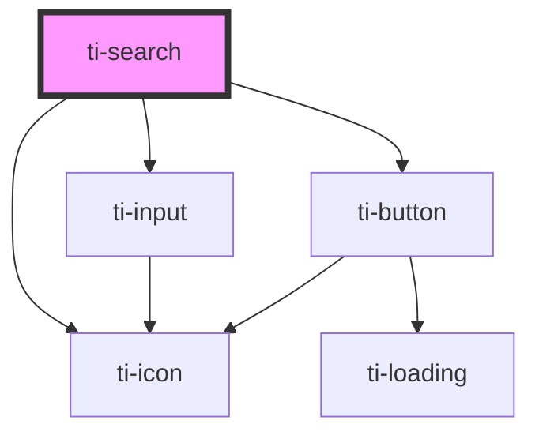

# ti-search

<!-- Auto Generated Below -->

## Properties

| Property            | Attribute             | Description      | Type      | Default     |
| ------------------- | --------------------- | ---------------- | --------- | ----------- |
| `alwaysShowSearch`  | `always-show-search`  |                  | `boolean` | `false`     |
| `animation`         | `animation`           |                  | `boolean` | `true`      |
| `autofocus`         | `autofocus`           |                  | `boolean` | `undefined` |
| `center`            | `center`              |                  | `boolean` | `undefined` |
| `clearable`         | `clearable`           |                  | `boolean` | `true`      |
| `confirmType`       | `confirm-type`        |                  | `string`  | `'search'`  |
| `disabled`          | `disabled`            |                  | `boolean` | `undefined` |
| `extClass`          | `ext-class`           | 额外的类名，添加到根节点的元素上 | `string`  | `''`        |
| `extStyle`          | --                    | 额外的样式            | `{}`      | `{}`        |
| `inputClass`        | `input-class`         |                  | `string`  | `''`        |
| `leftIcon`          | `left-icon`           |                  | `string`  | `'search'`  |
| `placeholder`       | `placeholder`         |                  | `string`  | `undefined` |
| `readOnly`          | `read-only`           |                  | `boolean` | `undefined` |
| `searchButtonClass` | `search-button-class` |                  | `string`  | `''`        |
| `searchInnerClass`  | `search-inner-class`  |                  | `string`  | `''`        |
| `useSearchButton`   | `use-search-button`   |                  | `boolean` | `true`      |
| `value`             | `value`               |                  | `string`  | `undefined` |

## Events

| Event    | Description | Type                                        |
| -------- | ----------- | ------------------------------------------- |
| `blur`   |             | `CustomEvent<never>`                        |
| `change` |             | `CustomEvent<{ value: string \| number; }>` |
| `clear`  |             | `CustomEvent<never>`                        |
| `click`  |             | `CustomEvent<never>`                        |
| `focus`  |             | `CustomEvent<never>`                        |
| `input`  |             | `CustomEvent<InputEvent>`                   |
| `search` |             | `CustomEvent<{ value: string \| number; }>` |

## Dependencies

### Depends on

- [ti-icon](../icon)
- [ti-input](../input)
- [ti-button](../button)

### Graph

----------------------------------------------

*Built with [StencilJS](https://stenciljs.com/)*
