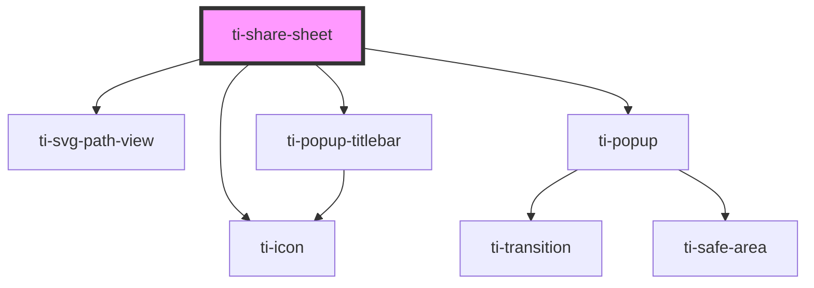

# ti-share-sheet

<!-- Auto Generated Below -->

## Properties

| Property               | Attribute                 | Description | Type                                       | Default                   |
| ---------------------- | ------------------------- | ----------- | ------------------------------------------ | ------------------------- |
| `cancelText`           | `cancel-text`             |             | `string`                                   | `defaultProps.cancelText` |
| `closeOnMask`          | `close-on-mask`           |             | `boolean`                                  | `true`                    |
| `extClass`             | `ext-class`               |             | `string`                                   | `''`                      |
| `extPopupClass`        | `ext-popup-class`         |             | `string`                                   | `''`                      |
| `extPopupContentClass` | `ext-popup-content-class` |             | `string`                                   | `''`                      |
| `extPopupMaskClass`    | `ext-popup-mask-class`    |             | `string`                                   | `''`                      |
| `extStyle`             | `ext-style`               |             | `string \| { [key: string]: string; }`     | `''`                      |
| `extTitleClass`        | `ext-title-class`         |             | `string`                                   | `''`                      |
| `options`              | --                        |             | `ShareSheetProps[] \| ShareSheetProps[][]` | `[]`                      |
| `subTitle`             | `sub-title`               |             | `string`                                   | `''`                      |
| `title`                | `title`                   |             | `string`                                   | `''`                      |
| `visible`              | `visible`                 |             | `boolean`                                  | `false`                   |

## Events

| Event     | Description | Type                   |
| --------- | ----------- | ---------------------- |
| `cancel`  |             | `CustomEvent<boolean>` |
| `close`   |             | `CustomEvent<boolean>` |
| `confirm` |             | `CustomEvent<boolean>` |

## Dependencies

### Depends on

- [ti-svg-path-view](../svg-path-view)
- [ti-icon](../icon)
- [ti-popup](../popup)
- [ti-popup-titlebar](../popup-titlebar)

### Graph

----------------------------------------------

*Built with [StencilJS](https://stenciljs.com/)*
