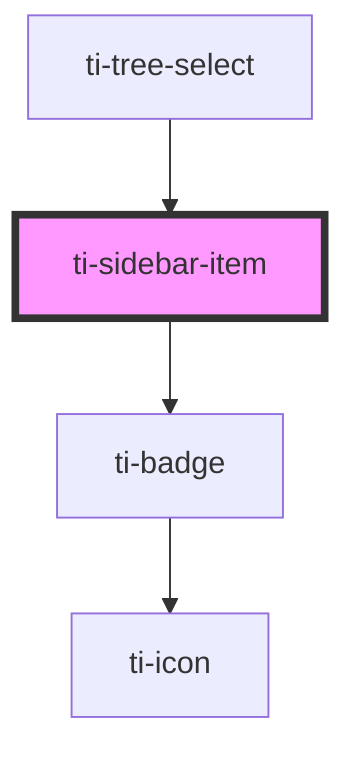

# ti-sidebar-item

<!-- Auto Generated Below -->

## Properties

| Property   | Attribute   | Description | Type                                   | Default |
| ---------- | ----------- | ----------- | -------------------------------------- | ------- |
| `badge`    | `badge`     |             | `string`                               | `''`    |
| `disabled` | `disabled`  |             | `boolean`                              | `false` |
| `dot`      | `dot`       |             | `boolean`                              | `false` |
| `extClass` | `ext-class` |             | `string`                               | `''`    |
| `extStyle` | `ext-style` |             | `string \| { [key: string]: string; }` | `''`    |
| `label`    | `label`     |             | `string`                               | `''`    |

## Methods

### `updateDataFromParent() => Promise<void>`

#### Returns

Type: `Promise<void>`

## Dependencies

### Used by

 - [ti-tree-select](../tree-select)

### Depends on

- [ti-badge](../badge)

### Graph

----------------------------------------------

*Built with [StencilJS](https://stenciljs.com/)*
