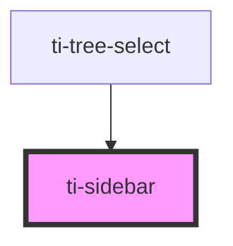

# ti-sidebar

<!-- Auto Generated Below -->

## Properties

| Property      | Attribute      | Description | Type                                   | Default |
| ------------- | -------------- | ----------- | -------------------------------------- | ------- |
| `activeIndex` | `active-index` |             | `number`                               | `0`     |
| `extClass`    | `ext-class`    |             | `string`                               | `''`    |
| `extStyle`    | `ext-style`    |             | `string \| { [key: string]: string; }` | `''`    |

## Events

| Event    | Description | Type                  |
| -------- | ----------- | --------------------- |
| `change` |             | `CustomEvent<number>` |

## Methods

### `getImperativeHandle() => Promise<{ children: HTMLTiSidebarItemElement[]; activeIndex: number; }>`

#### Returns

Type: `Promise<{ children: HTMLTiSidebarItemElement[]; activeIndex: number; }>`

### `setActive(index: number) => Promise<void>`

#### Returns

Type: `Promise<void>`

## Dependencies

### Used by

 - [ti-tree-select](../tree-select)

### Graph

----------------------------------------------

*Built with [StencilJS](https://stenciljs.com/)*
