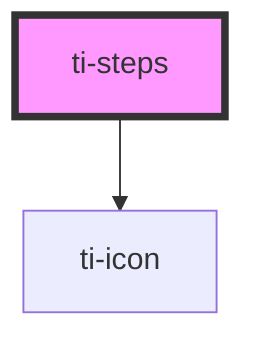

# ti-steps

<!-- Auto Generated Below -->

## Properties

| Property      | Attribute      | Description      | Type             | Default     |
| ------------- | -------------- | ---------------- | ---------------- | ----------- |
| `activeColor` | `active-color` |                  | `string`         | `undefined` |
| `current`     | `current`      |                  | `number`         | `0`         |
| `extClass`    | `ext-class`    | 额外的类名，添加到根节点的元素上 | `string`         | `undefined` |
| `extStyle`    | --             | 额外的样式            | `{}`             | `{}`        |
| `icon`        | `icon`         |                  | `string`         | `undefined` |
| `options`     | --             |                  | `TiStepOption[]` | `[]`        |

## Dependencies

### Depends on

- [ti-icon](../icon)

### Graph

----------------------------------------------

*Built with [StencilJS](https://stenciljs.com/)*
