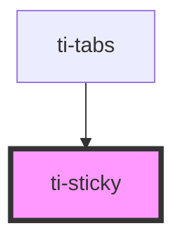

# ti-sticky

<!-- Auto Generated Below -->

## Properties

| Property    | Attribute    | Description | Type                | Default     |
| ----------- | ------------ | ----------- | ------------------- | ----------- |
| `container` | --           |             | `() => HTMLElement` | `undefined` |
| `disabled`  | `disabled`   |             | `boolean`           | `false`     |
| `offsetTop` | `offset-top` |             | `number`            | `0`         |
| `zIndex`    | `z-index`    |             | `number`            | `99`        |

## Dependencies

### Used by

 - [ti-tabs](../tabs)

### Graph

----------------------------------------------

*Built with [StencilJS](https://stenciljs.com/)*
