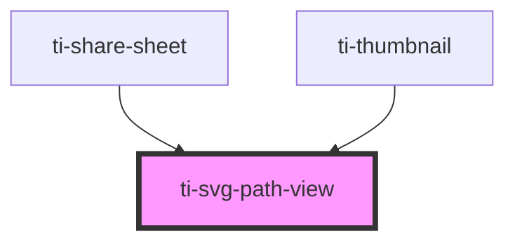

# ti-svg-path-view

<!-- Auto Generated Below -->

## Properties

| Property             | Attribute   | Description      | Type                                                       | Default           |
| -------------------- | ----------- | ---------------- | ---------------------------------------------------------- | ----------------- |
| `extClass`           | `ext-class` | 额外的类名，添加到根节点的元素上 | `string`                                                   | `undefined`       |
| `extStyle`           | `ext-style` | 额外的样式            | `string`                                                   | `undefined`       |
| `fills` _(required)_ | `fills`     |                  | `string \| string[]`                                       | `undefined`       |
| `name`               | `name`      |                  | `string`                                                   | `undefined`       |
| `paths`              | --          |                  | `SVGAttributes<SVGElement> \| SVGAttributes<SVGElement>[]` | `undefined`       |
| `rotate`             | `rotate`    |                  | `string`                                                   | `undefined`       |
| `size`               | `size`      |                  | `number \| string`                                         | `undefined`       |
| `spin`               | `spin`      |                  | `boolean`                                                  | `undefined`       |
| `viewBox`            | `view-box`  |                  | `string`                                                   | `'0 0 1024 1024'` |

## Dependencies

### Used by

 - [ti-share-sheet](../share-sheet)
 - [ti-thumbnail](../uploader)

### Graph

----------------------------------------------

*Built with [StencilJS](https://stenciljs.com/)*
