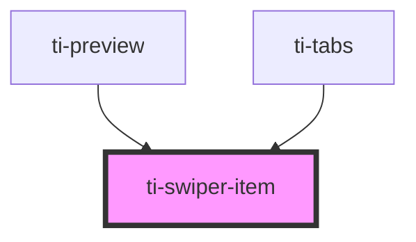

# ti-swiper-item

<!-- Auto Generated Below -->

## Properties

| Property               | Attribute                 | Description | Type      | Default |
| ---------------------- | ------------------------- | ----------- | --------- | ------- |
| `skipHiddenItemLayout` | `skip-hidden-item-layout` |             | `boolean` | `false` |

## Dependencies

### Used by

 - [ti-preview](../preview)
 - [ti-tabs](../tabs)

### Graph

----------------------------------------------

*Built with [StencilJS](https://stenciljs.com/)*
