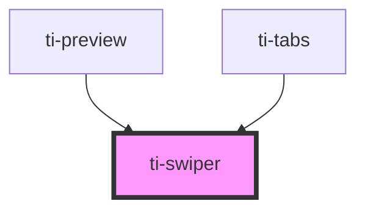

# ti-swiper

<!-- Auto Generated Below -->

## Properties

| Property          | Attribute           | Description | Type                                   | Default |
| ----------------- | ------------------- | ----------- | -------------------------------------- | ------- |
| `current`         | `current`           |             | `number`                               | `0`     |
| `extClass`        | `ext-class`         |             | `string`                               | `''`    |
| `extContentClass` | `ext-content-class` |             | `string`                               | `''`    |
| `extStyle`        | `ext-style`         |             | `string \| { [key: string]: string; }` | `''`    |
| `sports`          | `sports`            |             | `boolean`                              | `false` |
| `vertical`        | `vertical`          |             | `boolean`                              | `false` |

## Events

| Event             | Description | Type                  |
| ----------------- | ----------- | --------------------- |
| `animationFinish` |             | `CustomEvent<number>` |
| `change`          |             | `CustomEvent<number>` |

## Dependencies

### Used by

 - [ti-preview](../preview)
 - [ti-tabs](../tabs)

### Graph

----------------------------------------------

*Built with [StencilJS](https://stenciljs.com/)*
