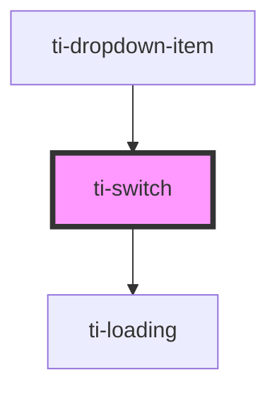

# ti-switch

<!-- Auto Generated Below -->

## Properties

| Property       | Attribute       | Description | Type                                   | Default                     |
| -------------- | --------------- | ----------- | -------------------------------------- | --------------------------- |
| `activeColor`  | `active-color`  |             | `string`                               | `undefined`                 |
| `color`        | `color`         |             | `string`                               | `undefined`                 |
| `defaultValue` | `default-value` |             | `boolean`                              | `defaultProps.defaultValue` |
| `disabled`     | `disabled`      |             | `boolean`                              | `undefined`                 |
| `extClass`     | `ext-class`     |             | `string`                               | `''`                        |
| `extStyle`     | `ext-style`     |             | `string \| { [key: string]: string; }` | `''`                        |
| `loading`      | `loading`       |             | `boolean`                              | `false`                     |
| `size`         | `size`          |             | `number`                               | `defaultProps.size`         |
| `value`        | --              |             | `unknown`                              | `undefined`                 |

## Events

| Event    | Description | Type                   |
| -------- | ----------- | ---------------------- |
| `change` |             | `CustomEvent<boolean>` |

## Dependencies

### Used by

 - [ti-dropdown-item](../dropdown-item)

### Depends on

- [ti-loading](../loading)

### Graph

----------------------------------------------

*Built with [StencilJS](https://stenciljs.com/)*
