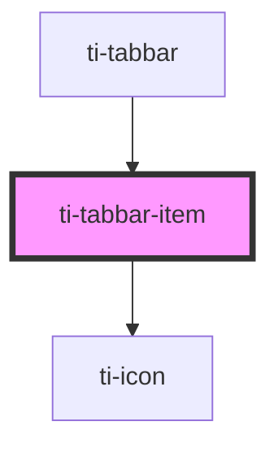

# ti-tabbar-item

<!-- Auto Generated Below -->

## Properties

| Property      | Attribute      | Description | Type                                   | Default                    |
| ------------- | -------------- | ----------- | -------------------------------------- | -------------------------- |
| `activeColor` | `active-color` |             | `string`                               | `defaultProps.activeColor` |
| `color`       | `color`        |             | `string`                               | `defaultProps.color`       |
| `extClass`    | `ext-class`    |             | `string`                               | `''`                       |
| `extStyle`    | `ext-style`    |             | `string \| { [key: string]: string; }` | `undefined`                |
| `icon`        | `icon`         |             | `string`                               | `''`                       |
| `iconSize`    | `icon-size`    |             | `number`                               | `defaultProps.iconSize`    |
| `title`       | `title`        |             | `string`                               | `''`                       |
| `titleSize`   | `title-size`   |             | `number`                               | `defaultProps.titleSize`   |
| `value`       | `value`        |             | `number`                               | `undefined`                |

## Methods

### `updateDataFromParent() => Promise<void>`

#### Returns

Type: `Promise<void>`

## Dependencies

### Used by

 - [ti-tabbar](../tabbar)

### Depends on

- [ti-icon](../icon)

### Graph

----------------------------------------------

*Built with [StencilJS](https://stenciljs.com/)*
