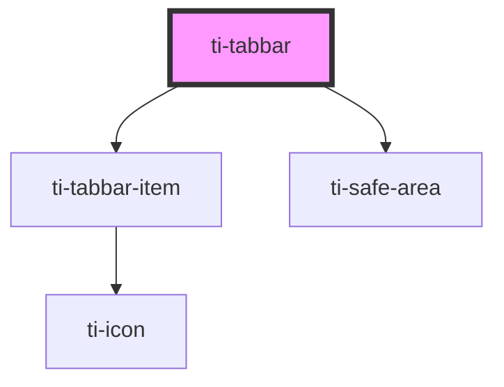

# ti-tabbar

<!-- Auto Generated Below -->

## Properties

| Property         | Attribute          | Description | Type                                           | Default                   |
| ---------------- | ------------------ | ----------- | ---------------------------------------------- | ------------------------- |
| `activeColor`    | `active-color`     |             | `string`                                       | `undefined`               |
| `color`          | `color`            |             | `string`                                       | `undefined`               |
| `extClass`       | `ext-class`        |             | `string`                                       | `''`                      |
| `extOptionClass` | `ext-option-class` |             | `string`                                       | `''`                      |
| `extOptionStyle` | `ext-option-style` |             | `string`                                       | `undefined`               |
| `extStyle`       | `ext-style`        |             | `string \| { [key: string]: string; }`         | `''`                      |
| `iconSize`       | `icon-size`        |             | `number`                                       | `undefined`               |
| `options`        | --                 |             | `Omit<TiTabbarItem, "updateDataFromParent">[]` | `[]`                      |
| `placeholder`    | `placeholder`      |             | `boolean`                                      | `true`                    |
| `safeArea`       | `safe-area`        |             | `boolean`                                      | `defaultProps.safeArea`   |
| `separation`     | `separation`       |             | `"" \| "border" \| "shadow"`                   | `defaultProps.separation` |
| `titleSize`      | `title-size`       |             | `number`                                       | `undefined`               |
| `value`          | --                 |             | `unknown`                                      | `undefined`               |

## Events

| Event    | Description | Type                   |
| -------- | ----------- | ---------------------- |
| `select` |             | `CustomEvent<unknown>` |

## Methods

### `getImperativeHandle() => Promise<{ children: HTMLTiTabbarItemElement[]; selectValue: unknown; }>`

#### Returns

Type: `Promise<{ children: HTMLTiTabbarItemElement[]; selectValue: unknown; }>`

### `switch(active: unknown) => Promise<void>`

#### Returns

Type: `Promise<void>`

## Dependencies

### Depends on

- [ti-tabbar-item](../tabbar-item)
- [ti-safe-area](../safe-area)

### Graph

----------------------------------------------

*Built with [StencilJS](https://stenciljs.com/)*
