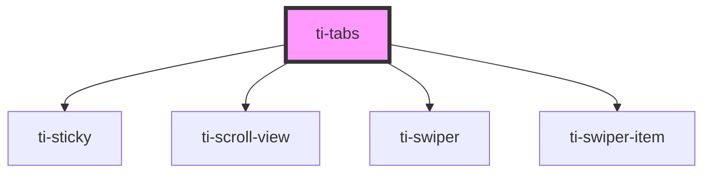

# ti-tabs

<!-- Auto Generated Below -->

## Properties

| Property         | Attribute          | Description | Type                                   | Default                    |
| ---------------- | ------------------ | ----------- | -------------------------------------- | -------------------------- |
| `activeTab`      | `active-tab`       |             | `number`                               | `defaultProps.activeTab`   |
| `autoGap`        | `auto-gap`         |             | `boolean`                              | `defaultProps.autoGap`     |
| `count`          | `count`            |             | `number`                               | `defaultProps.count`       |
| `disabledTabs`   | --                 |             | `unknown[]`                            | `[]`                       |
| `divider`        | `divider`          |             | `"default" \| "line" \| "shadow"`      | `defaultProps.divider`     |
| `extClass`       | `ext-class`        |             | `string`                               | `''`                       |
| `extStyle`       | `ext-style`        |             | `string \| { [key: string]: string; }` | `''`                       |
| `focusUpdate`    | `focus-update`     |             | `boolean`                              | `defaultProps.focusUpdate` |
| `gap`            | `gap`              |             | `number`                               | `defaultProps.gap`         |
| `sticky`         | `sticky`           |             | `boolean`                              | `false`                    |
| `swiperClass`    | `swiper-class`     |             | `string`                               | `''`                       |
| `tabActiveClass` | `tab-active-class` |             | `string`                               | `''`                       |
| `tabKey`         | `tab-key`          |             | `string`                               | `defaultProps.tabKey`      |
| `tabTextClass`   | `tab-text-class`   |             | `string`                               | `''`                       |
| `tabWidth`       | `tab-width`        |             | `number`                               | `defaultProps.tabWidth`    |
| `tabs`           | --                 |             | `string[]`                             | `[]`                       |
| `tabsClass`      | `tabs-class`       |             | `string`                               | `''`                       |
| `tabsMarkClass`  | `tabs-mark-class`  |             | `string`                               | `''`                       |
| `useSlot`        | `use-slot`         |             | `boolean`                              | `false`                    |
| `variant`        | `variant`          |             | `"block" \| "pure"`                    | `defaultProps.variant`     |

## Events

| Event    | Description | Type                                            |
| -------- | ----------- | ----------------------------------------------- |
| `change` |             | `CustomEvent<{ index: number; item: string; }>` |

## Dependencies

### Depends on

- [ti-sticky](../sticky)
- [ti-scroll-view](../scroll-view)
- [ti-swiper](../swiper)
- [ti-swiper-item](../swiper-item)

### Graph

----------------------------------------------

*Built with [StencilJS](https://stenciljs.com/)*
