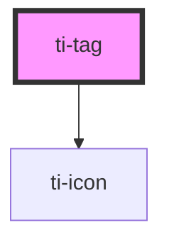

# ti-icon

<!-- Auto Generated Below -->

## Properties

| Property    | Attribute    | Description | Type                                       | Default                |
| ----------- | ------------ | ----------- | ------------------------------------------ | ---------------------- |
| `color`     | `color`      |             | `string`                                   | `undefined`            |
| `extClass`  | `ext-class`  |             | `string`                                   | `undefined`            |
| `extStyle`  | `ext-style`  |             | `string`                                   | `undefined`            |
| `leftIcon`  | `left-icon`  |             | `string`                                   | `''`                   |
| `rightIcon` | `right-icon` |             | `string`                                   | `''`                   |
| `shape`     | `shape`      |             | `"capsule" \| "leaf" \| "rect" \| "round"` | `defaultProps.shape`   |
| `size`      | `size`       |             | `"big" \| "medium" \| "small"`             | `defaultProps.size`    |
| `variant`   | `variant`    |             | `"contained" \| "filled" \| "outlined"`    | `defaultProps.variant` |

## Dependencies

### Depends on

- [ti-icon](../icon)

### Graph

----------------------------------------------

*Built with [StencilJS](https://stenciljs.com/)*
