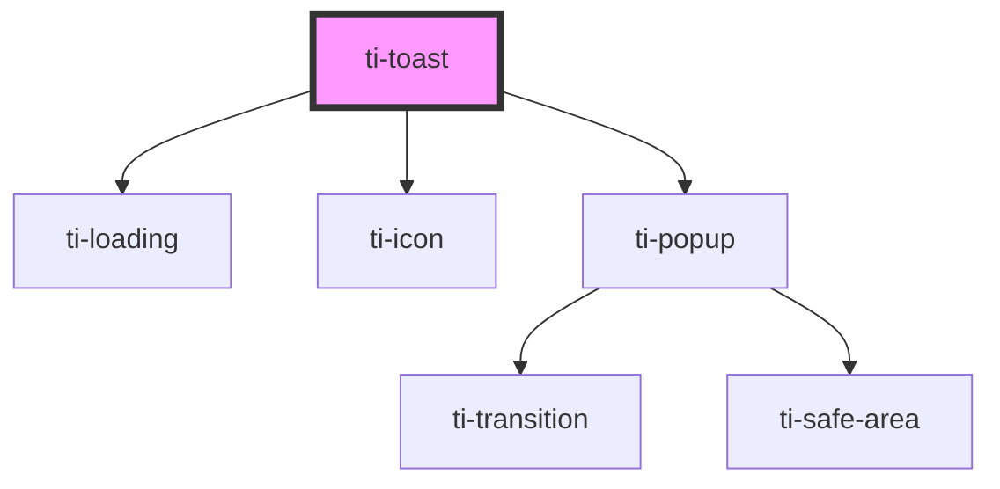

# ti-toast

<!-- Auto Generated Below -->

## Properties

| Property   | Attribute   | Description | Type     | Default |
| ---------- | ----------- | ----------- | -------- | ------- |
| `extStyle` | `ext-style` |             | `string` | `''`    |

## Methods

### `clear() => Promise<void>`

用户关闭

#### Returns

Type: `Promise<void>`

### `fail(opts: IToastStaticOptions | string) => Promise<void>`

#### Returns

Type: `Promise<void>`

### `info(opts: IToastStaticOptions | string) => Promise<void>`

#### Returns

Type: `Promise<void>`

### `loading(opts: IToastStaticOptions | string) => Promise<void>`

#### Returns

Type: `Promise<void>`

### `show(opts: IToastStaticOptions | string) => Promise<void>`

#### Returns

Type: `Promise<void>`

### `success(opts: IToastStaticOptions | string) => Promise<void>`

#### Returns

Type: `Promise<void>`

### `warn(opts: IToastStaticOptions | string) => Promise<void>`

#### Returns

Type: `Promise<void>`

## Dependencies

### Depends on

- [ti-loading](../loading)
- [ti-icon](../icon)
- [ti-popup](../popup)

### Graph

----------------------------------------------

*Built with [StencilJS](https://stenciljs.com/)*
