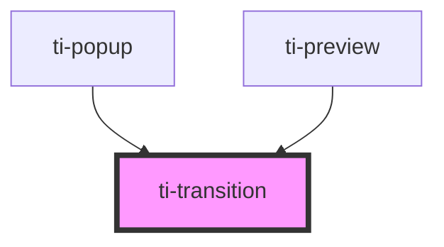

# ti-transition

<!-- Auto Generated Below -->

## Properties

| Property           | Attribute            | Description      | Type                                                                                                                                         | Default           |
| ------------------ | -------------------- | ---------------- | -------------------------------------------------------------------------------------------------------------------------------------------- | ----------------- |
| `customStyle`      | --                   |                  | `{}`                                                                                                                                         | `{}`              |
| `destroyOnExit`    | `destroy-on-exit`    |                  | `boolean`                                                                                                                                    | `false`           |
| `enterActiveClass` | `enter-active-class` |                  | `string`                                                                                                                                     | `''`              |
| `enterClass`       | `enter-class`        |                  | `string`                                                                                                                                     | `''`              |
| `enterDoneClass`   | `enter-done-class`   |                  | `string`                                                                                                                                     | `''`              |
| `enterName`        | `enter-name`         |                  | `string`                                                                                                                                     | `undefined`       |
| `exitActiveClass`  | `exit-active-class`  |                  | `string`                                                                                                                                     | `''`              |
| `exitClass`        | `exit-class`         |                  | `string`                                                                                                                                     | `''`              |
| `exitName`         | `exit-name`          |                  | `string`                                                                                                                                     | `undefined`       |
| `extClass`         | `ext-class`          | 额外的类名，添加到根节点的元素上 | `string`                                                                                                                                     | `''`              |
| `name`             | `name`               |                  | `"fade" \| "fade-down" \| "fade-left" \| "fade-right" \| "fade-up" \| "slide-down" \| "slide-left" \| "slide-right" \| "slide-up" \| "zoom"` | `'fade'`          |
| `show`             | `show`               |                  | `boolean`                                                                                                                                    | `false`           |
| `timeout`          | `timeout`            |                  | `Timout \| number`                                                                                                                           | `DEFAULT_TIMEOUT` |
| `timingFunction`   | `timing-function`    |                  | `string`                                                                                                                                     | `'linear'`        |

## Events

| Event      | Description | Type                |
| ---------- | ----------- | ------------------- |
| `enter`    |             | `CustomEvent<void>` |
| `entered`  |             | `CustomEvent<void>` |
| `entering` |             | `CustomEvent<void>` |
| `exit`     |             | `CustomEvent<void>` |
| `exited`   |             | `CustomEvent<void>` |
| `exiting`  |             | `CustomEvent<void>` |

## Dependencies

### Used by

 - [ti-popup](../popup)
 - [ti-preview](../preview)

### Graph

----------------------------------------------

*Built with [StencilJS](https://stenciljs.com/)*
