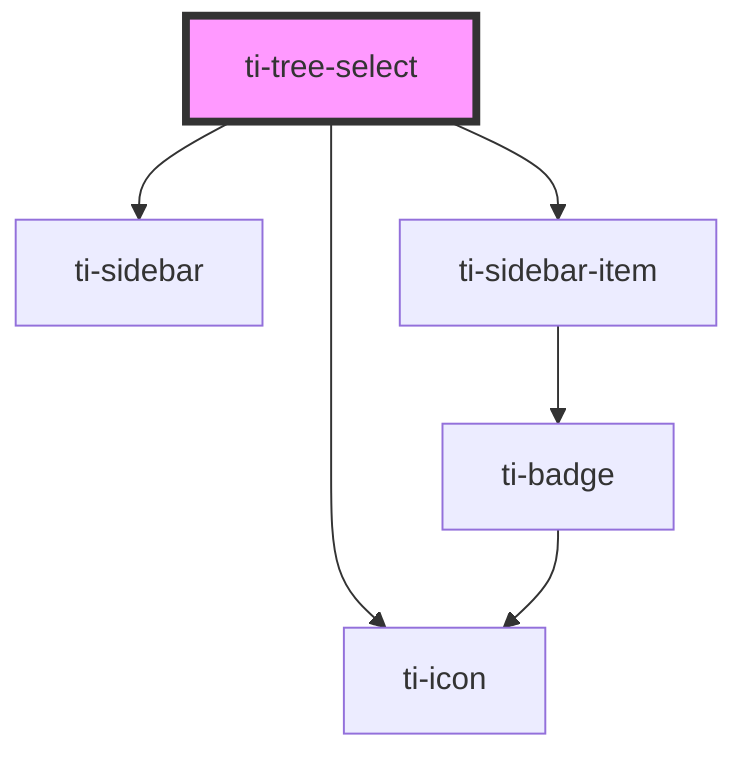

# ti-tree-select

<!-- Auto Generated Below -->

## Properties

| Property        | Attribute       | Description | Type                                   | Default                     |
| --------------- | --------------- | ----------- | -------------------------------------- | --------------------------- |
| `activeValue`   | --              |             | `string[]`                             | `[]`                        |
| `defaultIndex`  | `default-index` |             | `number`                               | `defaultProps.defaultIndex` |
| `disabledValue` | --              |             | `unknown[]`                            | `[]`                        |
| `extClass`      | `ext-class`     |             | `string`                               | `''`                        |
| `extStyle`      | `ext-style`     |             | `string \| { [key: string]: string; }` | `''`                        |
| `height`        | `height`        |             | `number \| string`                     | `defaultProps.height`       |
| `icon`          | `icon`          |             | `string`                               | `defaultProps.icon`         |
| `maxCount`      | `max-count`     |             | `number`                               | `defaultProps.maxCount`     |
| `options`       | --              |             | `TreeOption[]`                         | `[]`                        |

## Events

| Event        | Description | Type                                                                                                      |
| ------------ | ----------- | --------------------------------------------------------------------------------------------------------- |
| `changeItem` |             | `CustomEvent<{ item: TreeOption; activeValue: string[]; current: TreeOption & { isActive: boolean; }; }>` |
| `changeNav`  |             | `CustomEvent<{ index: number; item: TreeOption; }>`                                                       |

## Dependencies

### Depends on

- [ti-sidebar](../sidebar)
- [ti-sidebar-item](../sidebar-item)
- [ti-icon](../icon)

### Graph

----------------------------------------------

*Built with [StencilJS](https://stenciljs.com/)*
