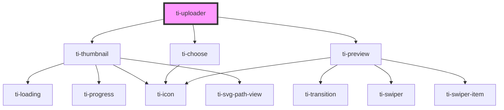

# ti-uploader

<!-- Auto Generated Below -->

## Properties

| Property            | Attribute              | Description | Type                                                                                                                               | Default                          |
| ------------------- | ---------------------- | ----------- | ---------------------------------------------------------------------------------------------------------------------------------- | -------------------------------- |
| `accept`            | `accept`               |             | `string`                                                                                                                           | `defaultProps.accept`            |
| `afterUpload`       | --                     |             | `(uploader: TiUploader, file: UploadFileExternal, fileMap: { [key: string]: UploadFileExternal; }) => Partial<UploadFileExternal>` | `undefined`                      |
| `beforeUpload`      | --                     |             | `(params: Params, file: UploadFileExternal, list: UploadFileExternal[]) => Params`                                                 | `undefined`                      |
| `camera`            | `camera`               |             | `"back" \| "front"`                                                                                                                | `UploadCamera.BACK`              |
| `choose`            | --                     |             | `(...agrn: unknown[]) => Promise<UploadFileExternal[]>`                                                                            | `undefined`                      |
| `chooseIcon`        | `choose-icon`          |             | `string`                                                                                                                           | `defaultProps.chooseIcon`        |
| `chooseText`        | `choose-text`          |             | `string`                                                                                                                           | `defaultProps.chooseText`        |
| `complete`          | --                     |             | `(file: UploadFileExternal, list: UploadFileExternal[], action: string) => void`                                                   | `undefined`                      |
| `count`             | `count`                |             | `number`                                                                                                                           | `defaultProps.count`             |
| `defaultValue`      | --                     |             | `UploadFileParams[]`                                                                                                               | `[]`                             |
| `disabled`          | `disabled`             |             | `boolean`                                                                                                                          | `false`                          |
| `extActionClass`    | `ext-action-class`     |             | `string`                                                                                                                           | `''`                             |
| `extClass`          | `ext-class`            |             | `string`                                                                                                                           | `''`                             |
| `extStyle`          | `ext-style`            |             | `string \| { [key: string]: string; }`                                                                                             | `''`                             |
| `extThumBoxClass`   | `ext-thum-box-class`   |             | `string`                                                                                                                           | `''`                             |
| `extThumClass`      | `ext-thum-class`       |             | `string`                                                                                                                           | `''`                             |
| `extThumImageClass` | `ext-thum-image-class` |             | `string`                                                                                                                           | `''`                             |
| `extThumOtherClass` | `ext-thum-other-class` |             | `string`                                                                                                                           | `''`                             |
| `extThumTipClass`   | `ext-thum-tip-class`   |             | `string`                                                                                                                           | `''`                             |
| `extThumVideoClass` | `ext-thum-video-class` |             | `string`                                                                                                                           | `''`                             |
| `fileParams`        | --                     |             | `{ [key: string]: unknown; }`                                                                                                      | `undefined`                      |
| `fileResultFormat`  | --                     |             | `(string \| number)[]`                                                                                                             | `[]`                             |
| `imageParams`       | --                     |             | `{ [key: string]: unknown; }`                                                                                                      | `undefined`                      |
| `imageResultFormat` | --                     |             | `(string \| number)[]`                                                                                                             | `[]`                             |
| `immediately`       | `immediately`          |             | `boolean`                                                                                                                          | `defaultProps.immediately`       |
| `immediatelyChoose` | `immediately-choose`   |             | `boolean`                                                                                                                          | `defaultProps.immediatelyChoose` |
| `preview`           | --                     |             | `(...agrn: unknown[]) => void`                                                                                                     | `undefined`                      |
| `size`              | `size`                 |             | `"large" \| "small"`                                                                                                               | `defaultProps.size`              |
| `sourceType`        | --                     |             | `("album" \| "camera")[]`                                                                                                          | `defaultProps.sourceType`        |
| `upload`            | --                     |             | `(uploader: TiUploader, key: string) => void`                                                                                      | `undefined`                      |
| `uploadExercise`    | `upload-exercise`      |             | `"" \| "loading" \| "progress"`                                                                                                    | `defaultProps.uploadExercise`    |
| `url`               | `url`                  |             | `string`                                                                                                                           | `''`                             |
| `value`             | --                     |             | `unknown`                                                                                                                          | `undefined`                      |
| `videoParams`       | --                     |             | `{ [key: string]: unknown; }`                                                                                                      | `undefined`                      |
| `videoResultFormat` | --                     |             | `(string \| number)[]`                                                                                                             | `[]`                             |

## Events

| Event    | Description | Type                                                                                                                                                           |
| -------- | ----------- | -------------------------------------------------------------------------------------------------------------------------------------------------------------- |
| `change` |             | `CustomEvent<{ fileList: Omit<Required<UploadFileExternal>, "size" \| "duration" \| "key" \| "file">[]; file: Omit<UploadFile, "key">; uploading: boolean; }>` |
| `choose` |             | `CustomEvent<any>`                                                                                                                                             |

## Methods

### `onSelect() => Promise<void>`

#### Returns

Type: `Promise<void>`

### `submit() => Promise<void>`

#### Returns

Type: `Promise<void>`

## Dependencies

### Depends on

- [ti-thumbnail](.)
- [ti-choose](.)
- [ti-preview](../preview)

### Graph

----------------------------------------------

*Built with [StencilJS](https://stenciljs.com/)*
